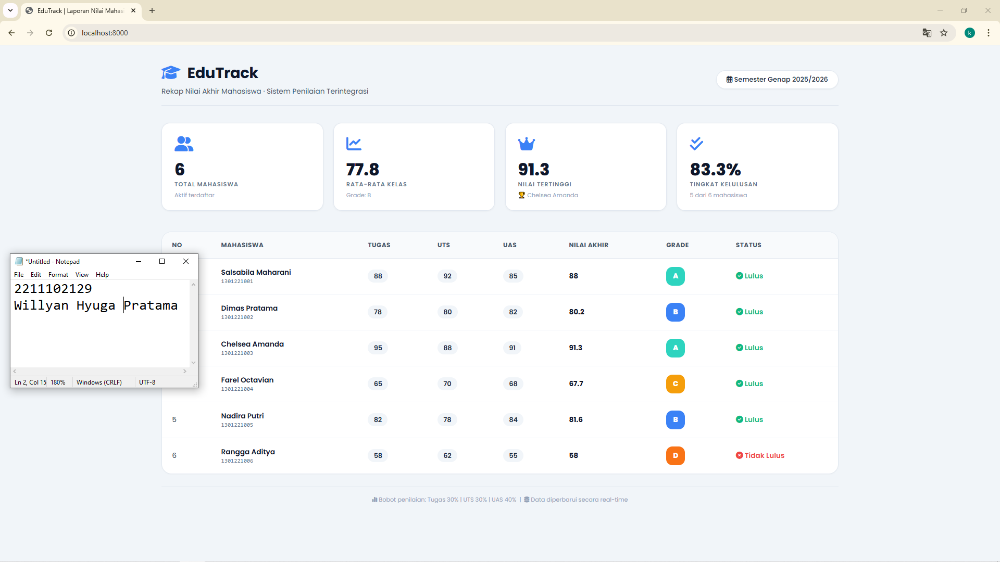

<div align="center">
    <br />
    <h1>LAPORAN PRAKTIKUM <br> APLIKASI BERBASIS PLATFORM </h1>
    <br />
    <h3>MODUL 9 <br> PHP </h3>
    <br />
    
    <br />
    <br />
    <br />
    <h3>Disusun Oleh :</h3>
    <p>
        <strong>Willyan Hyuga Pratama</strong>
        <br>
        <strong>2211102129</strong>
        <br>
        <strong>S1 IF-11-REG05</strong>
    </p>
    <br />
    <h3>Dosen Pengampu :</h3>
    <p>
        <strong>Dedi Agung Prabowo, S.Kom., M.Kom</strong>
    </p>
    <br />
    <br />
    <h4>Asisten Praktikum :</h4>
    <strong>Apri Pandu Wicaksono </strong>
    <br>
    <strong>Hamka Zaenul Ardi</strong>
    <br />
    <h3>LABORATORIUM HIGH PERFORMANCE <br>FAKULTAS INFORMATIKA <br>UNIVERSITAS TELKOM PURWOKERTO <br>2026 </h3>
</div>
<hr>

## Dasar Teori - PHP

PHP (Hypertext Preprocessor) adalah bahasa pemrograman sisi server (server-side scripting) yang dirancang khusus untuk pengembangan web dinamis. PHP bersifat open source dan dapat disisipkan langsung ke dalam kode HTML, sehingga memungkinkan pembuatan halaman web yang interaktif dan terhubung dengan basis data seperti MySQL. Ketika seorang pengguna mengakses halaman PHP, kode tersebut akan dieksekusi di server, dan hasilnya (berupa HTML murni) dikirimkan ke browser klien. PHP mendukung berbagai fitur seperti pemrosesan formulir, manajemen sesi, cookie, penanganan file, serta komunikasi dengan database, menjadikannya salah satu bahasa paling populer untuk membangun sistem informasi, e-commerce, dan aplikasi web skala besar.

Dalam konteks pembuatan website seperti EduTrack, PHP digunakan untuk mengolah data mahasiswa yang tersimpan dalam array multidimensi, menghitung nilai akhir menggunakan fungsi kustom (function), menentukan grade dan status kelulusan dengan logika percabangan (if-else), serta menampilkan hasilnya ke dalam tabel HTML secara dinamis. Kemampuan PHP untuk memisahkan logika backend dari tampilan frontend memungkinkan developer membangun aplikasi yang terstruktur, mudah dipelihara, dan dapat diintegrasikan dengan berbagai teknologi web modern seperti CSS framework dan JavaScript.


## Tugas Modul 9 - PHP: Buat Sistem Penilaian Mahasiswa

### Source Code

```php
<?php
$mahasiswa = [
    [
        'nama'         => 'Salsabila Maharani',
        'nim'          => '1301221001',
        'nilai_tugas'  => 88,
        'nilai_uts'    => 92,
        'nilai_uas'    => 85
    ],
    [
        'nama'         => 'Dimas Pratama',
        'nim'          => '1301221002',
        'nilai_tugas'  => 78,
        'nilai_uts'    => 80,
        'nilai_uas'    => 82
    ],
    [
        'nama'         => 'Chelsea Amanda',
        'nim'          => '1301221003',
        'nilai_tugas'  => 95,
        'nilai_uts'    => 88,
        'nilai_uas'    => 91
    ],
    [
        'nama'         => 'Farel Octavian',
        'nim'          => '1301221004',
        'nilai_tugas'  => 65,
        'nilai_uts'    => 70,
        'nilai_uas'    => 68
    ],
    [
        'nama'         => 'Nadira Putri',
        'nim'          => '1301221005',
        'nilai_tugas'  => 82,
        'nilai_uts'    => 78,
        'nilai_uas'    => 84
    ],
    [
        'nama'         => 'Rangga Aditya',
        'nim'          => '1301221006',
        'nilai_tugas'  => 58,
        'nilai_uts'    => 62,
        'nilai_uas'    => 55
    ]
];

function hitungNilaiAkhir($tugas, $uts, $uas) {
    $nilai_akhir = ($tugas * 0.30) + ($uts * 0.30) + ($uas * 0.40);
    return round($nilai_akhir, 2);
}

function tentukanGrade($nilai_akhir) {
    if ($nilai_akhir >= 85) return 'A';
    if ($nilai_akhir >= 75) return 'B';
    if ($nilai_akhir >= 65) return 'C';
    if ($nilai_akhir >= 50) return 'D';
    return 'E';
}

function tentukanStatus($nilai_akhir) {
    return $nilai_akhir >= 60 ? 'Lulus' : 'Tidak Lulus';
}

// Warna solid untuk grade (tanpa gradien)
function warnaGrade($grade) {
    $warna = [
        'A' => '#2dd4bf',
        'B' => '#3b82f6',
        'C' => '#f59e0b',
        'D' => '#f97316',
        'E' => '#ef4444'
    ];
    return $warna[$grade] ?? '#94a3b8';
}

$total_nilai = 0;
$nilai_tertinggi = 0;
$mahasiswa_terbaik = '';
$jumlah_lulus = 0;

foreach ($mahasiswa as $index => $mhs) {
    $na = hitungNilaiAkhir($mhs['nilai_tugas'], $mhs['nilai_uts'], $mhs['nilai_uas']);
    $mahasiswa[$index]['nilai_akhir'] = $na;
    $mahasiswa[$index]['grade'] = tentukanGrade($na);
    $mahasiswa[$index]['status'] = tentukanStatus($na);
    
    $total_nilai += $na;
    if ($na > $nilai_tertinggi) {
        $nilai_tertinggi = $na;
        $mahasiswa_terbaik = $mhs['nama'];
    }
    if ($mahasiswa[$index]['status'] == 'Lulus') $jumlah_lulus++;
}

$rata_rata = count($mahasiswa) > 0 ? round($total_nilai / count($mahasiswa), 2) : 0;
$persentase_lulus = count($mahasiswa) > 0 ? round(($jumlah_lulus / count($mahasiswa)) * 100, 1) : 0;
?>
```

**Kode Lengkap:** [index.php](index.php)

Output:


### Penjelasan

Website Tracking Nilai Mahasiswa adalah sistem penilaian mahasiswa berbasis PHP yang menampilkan data nilai tugas, UTS, dan UAS dalam bentuk tabel interaktif dengan tema terang (light theme), lengkap dengan perhitungan otomatis nilai akhir, grade A-E, serta statistik kelulusan. Seluruh data diproses menggunakan fungsi-fungsi PHP kustom dan ditampilkan secara dinamis tanpa perlu memuat ulang halaman, memberikan kemudahan bagi dosen atau akademisi dalam memantau performa akademik secara cepat dan terstruktur.