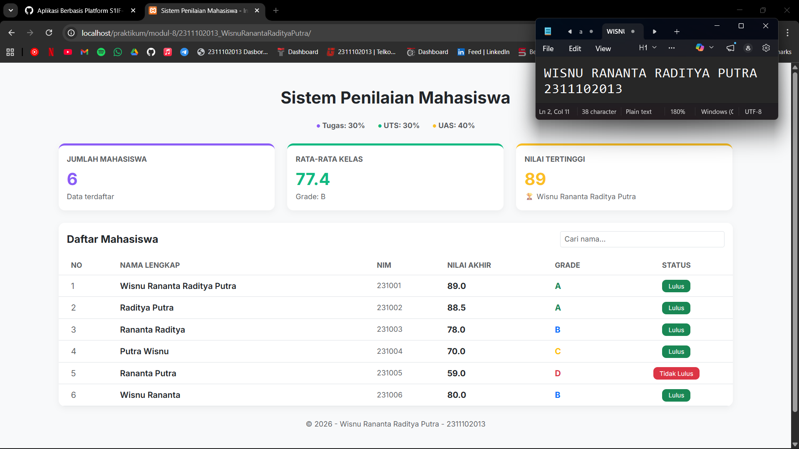

<div align="center">
  <br />
  <h1>LAPORAN PRAKTIKUM <br> APLIKASI BERBASIS PLATFORM </h1>
  <br />
  <h3>MODUL 9 <br> PHP </h3>
  <br />
  
  <br />
  <br />
  <br />
  <h3>Disusun Oleh :</h3>
  <p>
    <strong>Wisnu Rananta Raditya Putra</strong>
    <br>
    <strong>2311102013</strong>
    <br>
    <strong>S1 IF-11-REG05</strong>
  </p>
  <br />
  <h3>Dosen Pengampu :</h3>
  <p>
    <strong>Dedi Agung Prabowo, S.Kom., M.Kom</strong>
  </p>
  <br />
  <br />
  <h4>Asisten Praktikum :</h4>
  <strong>Apri Pandu Wicaksono </strong>
  <br>
  <strong>Hamka Zaenul Ardi</strong>
  <br />
  <h3>LABORATORIUM HIGH PERFORMANCE <br>FAKULTAS INFORMATIKA <br>UNIVERSITAS TELKOM PURWOKERTO <br>2026 </h3>
</div>

<hr>

# Dasar Teori

<p align="justify">
PHP (Hypertext Preprocessor) adalah bahasa pemrograman server-side yang digunakan untuk mengembangkan aplikasi web dinamis. Kode PHP dijalankan di server dan hasilnya dikirim ke browser dalam bentuk HTML, sehingga pengguna hanya melihat output tanpa mengetahui kode aslinya. PHP dapat dengan mudah diintegrasikan dengan HTML dan digunakan untuk mengelola data, seperti menyimpan, mengambil, dan memproses data dari database. Bahasa ini juga mendukung berbagai sistem database seperti MySQL dan PostgreSQL.
</p>

<p align="justify">
Keunggulan PHP antara lain mudah dipelajari, bersifat open-source (gratis), serta memiliki komunitas yang besar. PHP banyak digunakan dalam pengembangan berbagai jenis aplikasi web, seperti website dinamis, e-commerce, dan sistem manajemen konten (CMS). Dengan fleksibilitas dan kemampuannya dalam mengelola backend, PHP menjadi salah satu teknologi penting dalam pengembangan web modern.
</p>


## Tugas Modul 9 - PHP: Buat Sistem Penilaian Mahasiswa
### Souce code - index.php
```php
<?php

// Data mahasiswa

$data_mahasiswa = [
    ["nama" => "Wisnu Rananta Raditya Putra", "nim" => "231001", "nilai_tugas" => 90, "nilai_uts" => 80, "nilai_uas" => 95],
    ["nama" => "Raditya Putra", "nim" => "231002", "nilai_tugas" => 100, "nilai_uts" => 75, "nilai_uas" => 90],
    ["nama" => "Rananta Raditya", "nim" => "231003", "nilai_tugas" => 80, "nilai_uts" => 80, "nilai_uas" => 75],
    ["nama" => "Putra Wisnu", "nim" => "231004", "nilai_tugas" => 80, "nilai_uts" => 60, "nilai_uas" => 70],
    ["nama" => "Rananta Putra", "nim" => "231005", "nilai_tugas" => 60, "nilai_uts" => 50, "nilai_uas" => 65],
    ["nama" => "Wisnu Rananta", "nim" => "231006", "nilai_tugas" => 70, "nilai_uts" => 90, "nilai_uas" => 80],
];

function hitungNilaiAkhir($tugas, $uts, $uas) {
    return ($tugas * 0.3) + ($uts * 0.3) + ($uas * 0.4);
}

function tentukanGrade($nilai) {
    if ($nilai >= 85) return ["A", "text-success"];
    elseif ($nilai >= 75) return ["B", "text-primary"];
    elseif ($nilai >= 60) return ["C", "text-warning"];
    elseif ($nilai >= 50) return ["D", "text-danger"];
    else return ["E", "text-dark"];
}

function statusKelulusan($nilai) {
    return ($nilai >= 60) ? ["Lulus", "bg-success"] : ["Tidak Lulus", "bg-danger"];
}

// Menghitung statistik awal
$total_nilai = 0;
$nilai_tertinggi = 0;
$nama_tertinggi = "";
$jumlah_mahasiswa = count($data_mahasiswa);

foreach ($data_mahasiswa as $m) {
    $na = hitungNilaiAkhir($m['nilai_tugas'], $m['nilai_uts'], $m['nilai_uas']);
    $total_nilai += $na;
    if ($na > $nilai_tertinggi) {
        $nilai_tertinggi = $na;
        $nama_tertinggi = $m['nama'];
    }
}
$rata_rata = $total_nilai / $jumlah_mahasiswa;
list($grade_rata, $color_rata) = tentukanGrade($rata_rata);
?>

<!DOCTYPE html>
<html lang="id">
<head>
    <meta charset="UTF-8">
    <meta name="viewport" content="width=device-width, initial-scale=1.0">
    <title>Sistem Penilaian Mahasiswa - Informatika</title>
    <link href="https://cdn.jsdelivr.net/npm/bootstrap@5.3.0/dist/css/bootstrap.min.css" rel="stylesheet">
    <link href="https://fonts.googleapis.com/css2?family=Inter:wght@400;600;700&display=swap" rel="stylesheet">
    <style>
        body { font-family: 'Inter', sans-serif; background-color: #f8f9fa; }
        /* Modifikasi Card agar memiliki garis warna di atasnya seperti di gambar */
        .card { border: none; border-radius: 12px; box-shadow: 0 4px 12px rgba(0,0,0,0.05); }
        .card-ungu { border-top: 4px solid #8b5cf6; }
        .card-hijau { border-top: 4px solid #10b981; }
        .card-kuning { border-top: 4px solid #fbbf24; }
        
        .table thead { background-color: #f1f3f5; }
        .badge-status { font-weight: 500; border-radius: 8px; padding: 0.5em 1em; }
        
        /* Warna teks custom */
        .text-ungu { color: #8b5cf6 !important; }
        .text-hijau { color: #10b981 !important; }
        .text-kuning { color: #fbbf24 !important; }
    </style>
</head>
<body>

<div class="container py-5">
    <div class="row mb-3">
        <div class="col-12 text-center">
            <h2 class="fw-bold text-dark">Sistem Penilaian Mahasiswa</h2>
        </div>
    </div>

    <div class="d-flex justify-content-center gap-4 mb-4 text-muted fw-bold small">
        <span><span style="color: #8b5cf6;">●</span> Tugas: 30%</span>
        <span><span style="color: #10b981;">●</span> UTS: 30%</span>
        <span><span style="color: #fbbf24;">●</span> UAS: 40%</span>
    </div>

    <div class="row g-4 mb-4">
        <div class="col-md-4">
            <div class="card card-ungu p-3 h-100">
                <p class="text-muted mb-2 small text-uppercase fw-bold">Jumlah Mahasiswa</p>
                <h2 class="text-ungu mb-1 fw-bold"><?= $jumlah_mahasiswa ?></h2>
                <p class="text-muted small mb-0">Data terdaftar</p>
            </div>
        </div>

        <div class="col-md-4">
            <div class="card card-hijau p-3 h-100">
                <p class="text-muted mb-2 small text-uppercase fw-bold">Rata-Rata Kelas</p>
                <h2 class="text-hijau mb-1 fw-bold"><?= number_format($rata_rata, 1) ?></h2>
                <p class="text-muted small mb-0">Grade: <?= $grade_rata ?></p>
            </div>
        </div>

        <div class="col-md-4">
            <div class="card card-kuning p-3 h-100">
                <p class="text-muted mb-2 small text-uppercase fw-bold">Nilai Tertinggi</p>
                <h2 class="text-kuning mb-1 fw-bold"><?= number_format($nilai_tertinggi, 0) ?></h2>
                <p class="text-muted small mb-0">🏆 <?= $nama_tertinggi ?></p>
            </div>
        </div>
    </div>

    <div class="card overflow-hidden border-0">
        <div class="card-header bg-white py-3 d-flex justify-content-between align-items-center border-bottom-0">
            <h5 class="mb-0 fw-bold">Daftar Mahasiswa</h5>
            <input type="text" id="searchInput" class="form-control form-control-sm w-25" placeholder="Cari nama...">
        </div>
        <div class="table-responsive">
            <table class="table table-hover align-middle mb-0" id="mhsTable">
                <thead>
                    <tr>
                        <th class="ps-4 text-muted small text-uppercase">No</th>
                        <th class="text-muted small text-uppercase">Nama Lengkap</th>
                        <th class="text-muted small text-uppercase">NIM</th>
                        <th class="text-muted small text-uppercase">Nilai Akhir</th>
                        <th class="text-muted small text-uppercase">Grade</th>
                        <th class="text-center text-muted small text-uppercase">Status</th>
                    </tr>
                </thead>
                <tbody>
                    <?php $no = 1; foreach ($data_mahasiswa as $mhs): 
                        $na = hitungNilaiAkhir($mhs['nilai_tugas'], $mhs['nilai_uts'], $mhs['nilai_uas']);
                        list($grade, $gradeColor) = tentukanGrade($na);
                        list($status, $statusBg) = statusKelulusan($na);
                    ?>
                    <tr>
                        <td class="ps-4 text-muted"><?= $no++ ?></td>
                        <td><span class="fw-semibold text-dark"><?= $mhs['nama'] ?></span></td>
                        <td class="text-muted small"><?= $mhs['nim'] ?></td>
                        <td><span class="fw-bold text-dark"><?= number_format($na, 1) ?></span></td>
                        <td><span class="<?= $gradeColor ?> fw-bold"><?= $grade ?></span></td>
                        <td class="text-center">
                            <span class="badge <?= $statusBg ?> badge-status"><?= $status ?></span>
                        </td>
                    </tr>
                    <?php endforeach; ?>
                </tbody>
            </table>
        </div>
    </div>
    
    <footer class="mt-4 mb-5 text-center text-muted small">
        &copy; <?= date('Y') ?> - Wisnu Rananta Raditya Putra - 2311102013
    </footer>
</div>

<script>
    document.getElementById('searchInput').addEventListener('keyup', function() {
        let filter = this.value.toLowerCase();
        let rows = document.querySelectorAll('#mhsTable tbody tr');
        rows.forEach(row => {
            let name = row.cells[1].textContent.toLowerCase();
            row.style.display = name.includes(filter) ? '' : 'none';
        });
    });
</script>

</body>
</html>
```

### Screenshots Output


# Penjelasan
<p align="justify">
Kode tersebut merupakan sistem penilaian mahasiswa sederhana berbasis PHP yang menyimpan data mahasiswa dalam array, lalu mengolahnya menggunakan beberapa fungsi untuk menghitung nilai akhir, menentukan grade, dan status kelulusan. Selain itu, program juga menghitung statistik seperti rata-rata nilai dan nilai tertinggi dalam kelas.
</p>

<p align="justify">
Hasil pengolahan data ditampilkan menggunakan HTML dan Bootstrap dalam bentuk card dan tabel yang rapi dan responsif. Tabel menampilkan data lengkap mahasiswa beserta nilai, grade, dan status kelulusan, serta dilengkapi fitur pencarian menggunakan JavaScript agar pengguna dapat mencari nama mahasiswa secara langsung tanpa reload halaman.
</p>