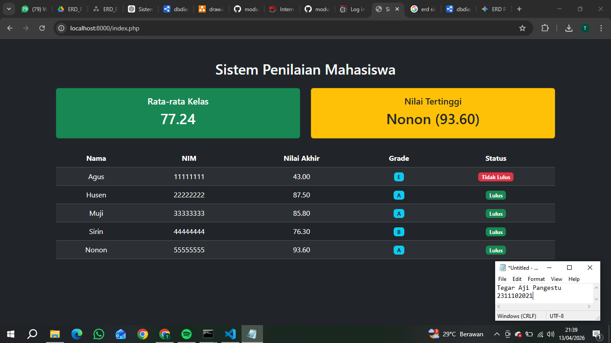

<div align="center">
  <br />
  <h1>LAPORAN PRAKTIKUM <br> APLIKASI BERBASIS PLATFORM </h1>
  <br />
  <h3>MODUL 9 <br> PHP </h3>
  <br />
  
  <br />
  <br />
  <br />
  <h3>Disusun Oleh :</h3>
  <p>
    <strong>Tegar Aji Pangestu</strong>
    <br>
    <strong>2311102021</strong>
    <br>
    <strong>S1 IF-11-REG05</strong>
  </p>
  <br />
  <h3>Dosen Pengampu :</h3>
  <p>
    <strong>Dedi Agung Prabowo, S.Kom., M.Kom</strong>
  </p>
  <br />
  <br />
  <h4>Asisten Praktikum :</h4>
  <strong>Apri Pandu Wicaksono </strong>
  <br>
  <strong>Hamka Zaenul Ardi</strong>
  <br />
  <h3>LABORATORIUM HIGH PERFORMANCE <br>FAKULTAS INFORMATIKA <br>UNIVERSITAS TELKOM PURWOKERTO <br>2026 </h3>
</div>

<hr>

# Dasar Teori

PHP (Hypertext Preprocessor) adalah bahasa pemrograman sisi server (server-side scripting) yang banyak digunakan untuk membangun website dinamis dan aplikasi berbasis web. PHP dapat disisipkan langsung ke dalam kode HTML sehingga memudahkan pengembang untuk membuat halaman web yang interaktif dan dinamis. Bahasa ini mendukung berbagai fitur seperti pengolahan form, manajemen sesi, manipulasi database, serta pembuatan dan pengolahan file. PHP juga kompatibel dengan berbagai sistem operasi dan web server, sehingga sangat fleksibel dan mudah digunakan dalam pengembangan web.

Dalam pengembangan aplikasi web, PHP sering dipadukan dengan database seperti MySQL untuk menyimpan dan mengelola data. PHP memiliki sintaks yang relatif mudah dipahami, sehingga cocok bagi pemula maupun pengembang profesional. Dengan dukungan komunitas yang besar dan dokumentasi yang lengkap, PHP menjadi salah satu pilihan utama dalam pengembangan web modern, baik untuk aplikasi sederhana maupun sistem yang lebih kompleks seperti e-commerce, sistem manajemen konten, dan portal informasi.
# Tugas 9 - Sistem Penilaian Mahasiswa
## Source code 
```<!-- 2311102021
Tegar Aji pangestu
S1IF-11-05 -->
<?php
// ================= DATA MAHASISWA =================
$data = [
    ["nama"=>"Agus","nim"=>"11111111","tugas"=>60,"uts"=>30,"uas"=>40],
    ["nama"=>"Husen","nim"=>"22222222","tugas"=>90,"uts"=>87,"uas"=>86],
    ["nama"=>"Muji","nim"=>"33333333","tugas"=>90,"uts"=>88,"uas"=>81],
    ["nama"=>"Sirin","nim"=>"44444444","tugas"=>86,"uts"=>75,"uas"=>70],
    ["nama"=>"Nonon","nim"=>"55555555","tugas"=>100,"uts"=>92,"uas"=>90]
];

// ================= FUNCTION =================
function hitungAkhir($t, $u, $a){
    return ($t*0.3) + ($u*0.3) + ($a*0.4);
}

function grade($n){
    if($n >= 85) return "A";
    elseif($n >= 75) return "B";
    elseif($n >= 65) return "C";
    elseif($n >= 50) return "D";
    else return "E";
}


$total = 0;
$max = 0;
$top = "";

foreach($data as $m){
    $na = hitungAkhir($m["tugas"],$m["uts"],$m["uas"]);
    $total += $na;
    if($na > $max){
        $max = $na;
        $top = $m["nama"];
    }
}
$rata = $total / count($data);
?>

<!DOCTYPE html>
<html lang="id">
<head>
<meta charset="UTF-8">
<title>Sistem Penilaian</title>
<link href="https://cdn.jsdelivr.net/npm/bootstrap@5.3.3/dist/css/bootstrap.min.css" rel="stylesheet">
</head>

<body class="bg-dark text-light">

<div class="container mt-5">

<h2 class="text-center mb-4">Sistem Penilaian Mahasiswa</h2>

<div class="row mb-4">
    <div class="col-md-6">
        <div class="card bg-success text-white text-center">
            <div class="card-body">
                <h5>Rata-rata Kelas</h5>
                <h2><?= number_format($rata,2) ?></h2>
            </div>
        </div>
    </div>

    <div class="col-md-6">
        <div class="card bg-warning text-dark text-center">
            <div class="card-body">
                <h5>Nilai Tertinggi</h5>
                <h2><?= $top ?> (<?= number_format($max,2) ?>)</h2>
            </div>
        </div>
    </div>
</div>

<table class="table table-dark table-striped table-hover text-center">
<thead>
<tr>
    <th>Nama</th>
    <th>NIM</th>
    <th>Nilai Akhir</th>
    <th>Grade</th>
    <th>Status</th>
</tr>
</thead>

<tbody>
<?php foreach($data as $m): 
    $na = hitungAkhir($m["tugas"],$m["uts"],$m["uas"]);
    $g = grade($na);
    $status = ($na >= 65) ? "Lulus" : "Tidak Lulus";
?>
<tr>
    <td><?= $m["nama"] ?></td>
    <td><?= $m["nim"] ?></td>
    <td><?= number_format($na,2) ?></td>
    <td>
        <span class="badge bg-info text-dark"><?= $g ?></span>
    </td>
    <td>
        <span class="badge <?= $status=="Lulus" ? "bg-success" : "bg-danger" ?>">
            <?= $status ?>
        </span>
    </td>
</tr>
<?php endforeach; ?>
</tbody>
</table>

</div>

</body>
</html>
```

Output:


# Penjelasan
Program PHP tersebut merupakan aplikasi sederhana untuk menampilkan dan mengolah data nilai mahasiswa secara otomatis. Data mahasiswa disimpan dalam bentuk array asosiatif yang memuat informasi nama, NIM, serta nilai tugas, UTS, dan UAS. Program menghitung nilai akhir berdasarkan bobot tertentu menggunakan fungsi khusus, kemudian menentukan grade dan status kelulusan berdasarkan nilai akhir tersebut. Hasil perhitungan ditampilkan dalam bentuk tabel yang memuat nilai akhir, grade, dan keterangan lulus atau tidak lulus, serta dilengkapi informasi rata-rata nilai kelas dan nilai tertinggi untuk memberikan gambaran performa keseluruhan mahasiswa.

