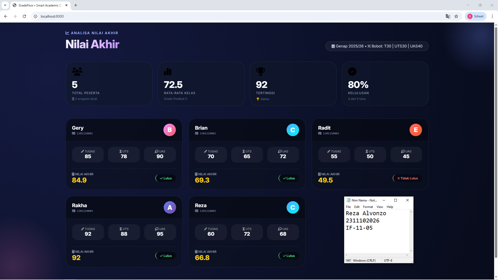

<div align="center">
    <br />
    <h1>LAPORAN PRAKTIKUM <br> APLIKASI BERBASIS PLATFORM </h1>
    <br />
    <h3>MODUL 9 <br> PHP </h3>
    <br />
    
    <br />
    <br />
    <br />
    <h3>Disusun Oleh :</h3>
    <p>
        <strong>Reza Alvonzo</strong>
        <br>
        <strong>2311102026</strong>
        <br>
        <strong>S1 IF-11-REG05</strong>
    </p>
    <br />
    <h3>Dosen Pengampu :</h3>
    <p>
        <strong>Dedi Agung Prabowo, S.Kom., M.Kom</strong>
    </p>
    <br />
    <br />
    <h4>Asisten Praktikum :</h4>
    <strong>Apri Pandu Wicaksono </strong>
    <br>
    <strong>Hamka Zaenul Ardi</strong>
    <br />
    <h3>LABORATORIUM HIGH PERFORMANCE <br>FAKULTAS INFORMATIKA <br>UNIVERSITAS TELKOM PURWOKERTO <br>2026 </h3>
</div>
<hr>

## Dasar Teori - PHP

PHP (Hypertext Preprocessor) adalah bahasa pemrograman sisi server (server-side scripting) yang dirancang khusus untuk pengembangan web. PHP bersifat open source dan dapat disisipkan langsung ke dalam kode HTML, sehingga memungkinkan pembuatan halaman web yang dinamis dan interaktif. Ketika seorang pengguna mengakses halaman PHP, kode tersebut akan dieksekusi di server, dan hasilnya (berupa HTML murni) dikirimkan ke browser pengguna. PHP mendukung berbagai database seperti MySQL, PostgreSQL, dan MongoDB, serta memiliki ribuan fungsi bawaan untuk menangani form, session, cookie, file handling, dan masih banyak lagi.

Dalam konteks penilaian akademik seperti pada kode yang telah dibuat, PHP digunakan untuk mengolah data mahasiswa secara terstruktur menggunakan array multidimensi, menghitung nilai akhir dengan fungsi kustom (function), menentukan grade dan status kelulusan berdasarkan logika percabangan (if-else), serta menampilkan hasilnya ke dalam antarmuka web. Kemampuan PHP untuk memisahkan logika pemrograman (backend) dari tampilan (frontend) memungkinkan developer membangun sistem yang rapi, mudah dipelihara, dan scalable — cocok untuk aplikasi seperti dashboard nilai, sistem registrasi, e-commerce, hingga sistem informasi manajemen.


## Tugas Modul 9 - PHP: Buat Sistem Penilaian Mahasiswa

### Source Code

```php
<?php
$mahasiswa = [
    [
        'nama'         => 'Gery',
        'nim'          => '1301210001',
        'nilai_tugas'  => 85,
        'nilai_uts'    => 78,
        'nilai_uas'    => 90
    ],
    [
        'nama'         => 'Brian',
        'nim'          => '1301210002',
        'nilai_tugas'  => 70,
        'nilai_uts'    => 65,
        'nilai_uas'    => 72
    ],
    [
        'nama'         => 'Radit',
        'nim'          => '1301210003',
        'nilai_tugas'  => 55,
        'nilai_uts'    => 50,
        'nilai_uas'    => 45
    ],
    [
        'nama'         => 'Rakha',
        'nim'          => '1301210004',
        'nilai_tugas'  => 92,
        'nilai_uts'    => 88,
        'nilai_uas'    => 95
    ],
    [
        'nama'         => 'Reza',
        'nim'          => '1301210005',
        'nilai_tugas'  => 60,
        'nilai_uts'    => 72,
        'nilai_uas'    => 68
    ]
];

function hitungNilaiAkhir($tugas, $uts, $uas) {
    $nilai_akhir = ($tugas * 0.30) + ($uts * 0.30) + ($uas * 0.40);
    return round($nilai_akhir, 2);
}

function tentukanGrade($nilai_akhir) {
    if ($nilai_akhir >= 85) return 'A';
    if ($nilai_akhir >= 75) return 'B';
    if ($nilai_akhir >= 65) return 'C';
    if ($nilai_akhir >= 50) return 'D';
    return 'E';
}

function tentukanStatus($nilai_akhir) {
    return $nilai_akhir >= 60 ? 'Lulus' : 'Tidak Lulus';
}

function getGradientGrade($grade) {
    $gradients = [
        'A' => 'linear-gradient(135deg, #667eea 0%, #764ba2 100%)',
        'B' => 'linear-gradient(135deg, #f093fb 0%, #f5576c 100%)',
        'C' => 'linear-gradient(135deg, #4facfe 0%, #00f2fe 100%)',
        'D' => 'linear-gradient(135deg, #fa709a 0%, #fee140 100%)',
        'E' => 'linear-gradient(135deg, #ff6b6b 0%, #ee5a24 100%)'
    ];
    return $gradients[$grade] ?? $gradients['E'];
}

$total_nilai = 0;
$nilai_tertinggi = 0;
$mahasiswa_terbaik = '';
$jumlah_lulus = 0;

foreach ($mahasiswa as $index => $mhs) {
    $na = hitungNilaiAkhir($mhs['nilai_tugas'], $mhs['nilai_uts'], $mhs['nilai_uas']);
    $mahasiswa[$index]['nilai_akhir'] = $na;
    $mahasiswa[$index]['grade'] = tentukanGrade($na);
    $mahasiswa[$index]['status'] = tentukanStatus($na);
    
    $total_nilai += $na;
    if ($na > $nilai_tertinggi) {
        $nilai_tertinggi = $na;
        $mahasiswa_terbaik = $mhs['nama'];
    }
    if ($mahasiswa[$index]['status'] == 'Lulus') $jumlah_lulus++;
}

$rata_rata = count($mahasiswa) > 0 ? round($total_nilai / count($mahasiswa), 2) : 0;
$persentase_lulus = count($mahasiswa) > 0 ? round(($jumlah_lulus / count($mahasiswa)) * 100, 1) : 0;
?>
<!DOCTYPE html>
<html lang="id">
<head>
    <meta charset="UTF-8">
    <meta name="viewport" content="width=device-width, initial-scale=1.0">
    <title>GradeFlow • Smart Academic Dashboard</title>
    <link href="https://fonts.googleapis.com/css2?family=Inter:opsz,wght@14..32,300;14..32,400;14..32,600;14..32,700;14..32,800&display=swap" rel="stylesheet">
    <link rel="stylesheet" href="https://cdnjs.cloudflare.com/ajax/libs/font-awesome/6.5.1/css/all.min.css">
    <style>
        * {
            margin: 0;
            padding: 0;
            box-sizing: border-box;
        }

        body {
            font-family: 'Inter', sans-serif;
            background: #0a0e27;
            background-image: radial-gradient(circle at 10% 20%, rgba(21, 27, 67, 0.9) 0%, #070b1a 100%);
            min-height: 100vh;
            padding: 2rem;
            position: relative;
        }
```

**Kode Lengkap:** [index.php](index.php)

Output:


### Penjelasan

Website ini merupakan dashboard penilaian mahasiswa interaktif yang menampilkan data nilai tugas, UTS, dan UAS dalam bentuk kartu-kartu modern dengan efek glassmorphism, dilengkapi perhitungan otomatis nilai akhir, grade (A-E), serta status kelulusan menggunakan bahasa pemrograman PHP. Sistem ini juga menyajikan ringkasan statistik seperti rata-rata kelas, nilai tertinggi, dan persentase kelulusan untuk memudahkan dosen atau akademisi dalam memantau performa akademik secara real-time.