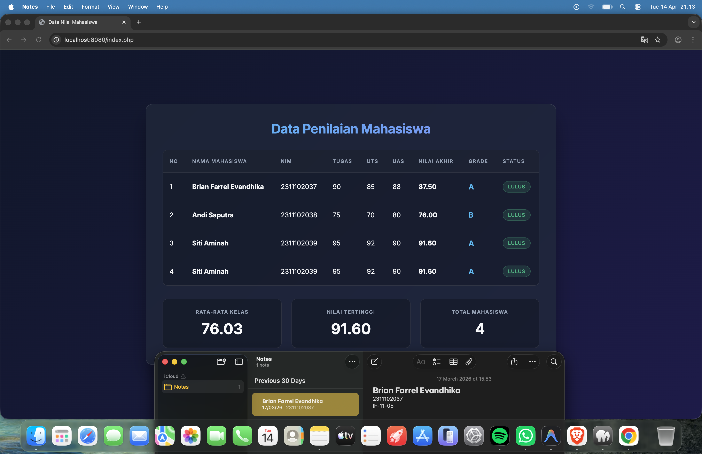

<div align="center">
  <br />
  <h1>LAPORAN PRAKTIKUM <br> APLIKASI BERBASIS PLATFORM </h1>
  <br />
  <h3>MODUL 8 <br> PHP </h3>
  <br />
  
  <br />
  <br />
  <br />
  <h3>Disusun Oleh :</h3>
  <p>
    <strong>Brian Farrel Evandhika</strong>
    <br>
    <strong>2311102037</strong>
    <br>
    <strong>S1 IF-11-REG05</strong>
  </p>
  <br />
  <h3>Dosen Pengampu :</h3>
  <p>
    <strong>Dedi Agung Prabowo, S.Kom., M.Kom</strong>
  </p>
  <br />
  <br />
  <h4>Asisten Praktikum :</h4>
  <strong>Apri Pandu Wicaksono </strong>
  <br>
  <strong>Hamka Zaenul Ardi</strong>
  <br />
  <h3>LABORATORIUM HIGH PERFORMANCE <br>FAKULTAS INFORMATIKA <br>UNIVERSITAS TELKOM PURWOKERTO <br>2026 </h3>
</div>

<hr>

# Dasar Teori

<p align="justify">
PHP (Hypertext Preprocessor) adalah bahasa pemrograman server-side yang digunakan untuk mengembangkan aplikasi web dinamis. Kode PHP dijalankan di server dan hasilnya dikirim ke browser dalam bentuk HTML, sehingga pengguna hanya melihat output tanpa mengetahui kode aslinya. PHP dapat dengan mudah diintegrasikan dengan HTML dan digunakan untuk mengelola data, seperti menyimpan, mengambil, dan memproses data dari database. Bahasa ini juga mendukung berbagai sistem database seperti MySQL dan PostgreSQL.
</p>

<p align="justify">
Keunggulan PHP antara lain mudah dipelajari, bersifat open-source (gratis), serta memiliki komunitas yang besar. PHP banyak digunakan dalam pengembangan berbagai jenis aplikasi web, seperti website dinamis, e-commerce, dan sistem manajemen konten (CMS). Dengan fleksibilitas dan kemampuannya dalam mengelola backend, PHP menjadi salah satu teknologi penting dalam pengembangan web modern.
</p>

## Tugas Modul 8 - PHP: Buat Sistem Penilaian Mahasiswa
### Source code - index.php
```php
<?php
// Function untuk menghitung nilai akhir dengan operator aritmatika
function hitungNilaiAkhir($tugas, $uts, $uas) {
    // Bobot penilaian: Tugas 20%, UTS 30%, UAS 50%
    return ($tugas * 0.2) + ($uts * 0.3) + ($uas * 0.5);
}

// Function untuk menentukan Status dengan operator perbandingan
function tentukanStatus($nilaiAkhir) {
    // Jika nilai akhir >= 60, maka Lulus
    return ($nilaiAkhir >= 60) ? "Lulus" : "Tidak Lulus";
}

// Function untuk menentukan Grade dengan if/else
function tentukanGrade($nilaiAkhir) {
    if ($nilaiAkhir >= 85) {
        return "A";
    } elseif ($nilaiAkhir >= 70) {
        return "B";
    } elseif ($nilaiAkhir >= 60) {
        return "C";
    } elseif ($nilaiAkhir >= 50) {
        return "D";
    } else {
        return "E";
    }
}

// Array Asosiatif untuk menyimpan data mahasiswa minimal 3
$mahasiswa = [
    [
        "nama" => "Brian Farrel Evandhika",
        "nim" => "2311102037",
        "nilai_tugas" => 90,
        "nilai_uts" => 85,
        "nilai_uas" => 88
    ],
    [
        "nama" => "Andi Saputra",
        "nim" => "2311102038",
        "nilai_tugas" => 75,
        "nilai_uts" => 70,
        "nilai_uas" => 80
    ],
    [
        "nama" => "Siti Aminah",
        "nim" => "2311102039",
        "nilai_tugas" => 95,
        "nilai_uts" => 92,
        "nilai_uas" => 90
    ],
    [
        "nama" => "Budi Santoso",
        "nim" => "2311102040",
        "nilai_tugas" => 50,
        "nilai_uts" => 55,
        "nilai_uas" => 45
    ]
];

$totalNilaiAkhir = 0;
$nilaiTertinggi = 0;

// Loop untuk memproses perhitungan setiap mahasiswa
foreach ($mahasiswa as &$mhs) {
    $mhs['nilai_akhir'] = hitungNilaiAkhir($mhs['nilai_tugas'], $mhs['nilai_uts'], $mhs['nilai_uas']);
    $mhs['grade'] = tentukanGrade($mhs['nilai_akhir']);
    $mhs['status'] = tentukanStatus($mhs['nilai_akhir']);
    
    $totalNilaiAkhir += $mhs['nilai_akhir'];
    
    if ($mhs['nilai_akhir'] > $nilaiTertinggi) {
        $nilaiTertinggi = $mhs['nilai_akhir'];
    }
}

$rataRataKelas = count($mahasiswa) > 0 ? $totalNilaiAkhir / count($mahasiswa) : 0;
?>

<!DOCTYPE html>
<html lang="id">
<head>
    <meta charset="UTF-8">
    <meta name="viewport" content="width=device-width, initial-scale=1.0">
    <title>Data Nilai Mahasiswa</title>
    <link href="https://fonts.googleapis.com/css2?family=Inter:wght@400;500;600;700&display=swap" rel="stylesheet">
    <style>
        :root {
            --bg-color: #0f172a;
            --container-bg: rgba(30, 41, 59, 0.7);
            --text-main: #f8fafc;
            --text-muted: #94a3b8;
            --border-color: rgba(255, 255, 255, 0.1);
            --accent-green: #10b981;
            --accent-red: #ef4444;
            --accent-blue: #38bdf8;
        }

        * {
            box-sizing: border-box;
            margin: 0;
            padding: 0;
        }

        body {
            font-family: 'Inter', sans-serif;
            background: linear-gradient(135deg, #0f172a, #1e1b4b);
            color: var(--text-main);
            min-height: 100vh;
            display: flex;
            justify-content: center;
            align-items: center;
            padding: 2rem;
        }

        .container {
            background: var(--container-bg);
            backdrop-filter: blur(12px);
            -webkit-backdrop-filter: blur(12px);
            border-radius: 16px;
            border: 1px solid var(--border-color);
            padding: 2.5rem;
            width: 100%;
            max-width: 1000px;
            box-shadow: 0 25px 50px -12px rgba(0, 0, 0, 0.5);
            animation: fadeIn 0.8s cubic-bezier(0.16, 1, 0.3, 1);
        }

        @keyframes fadeIn {
            from { opacity: 0; transform: translateY(30px); }
            to { opacity: 1; transform: translateY(0); }
        }

        h2 {
            text-align: center;
            margin-bottom: 2rem;
            font-weight: 700;
            font-size: 2rem;
            letter-spacing: -0.025em;
            background: linear-gradient(to right, #38bdf8, #818cf8);
            -webkit-background-clip: text;
            -webkit-text-fill-color: transparent;
        }

        .table-responsive {
            overflow-x: auto;
            margin-bottom: 2rem;
            border-radius: 12px;
            border: 1px solid var(--border-color);
            background: rgba(0, 0, 0, 0.2);
        }

        table {
            width: 100%;
            border-collapse: collapse;
        }

        th, td {
            padding: 1.25rem 1rem;
            text-align: left;
            border-bottom: 1px solid var(--border-color);
        }

        th {
            font-weight: 600;
            color: var(--text-muted);
            text-transform: uppercase;
            font-size: 0.75rem;
            letter-spacing: 0.1em;
            background: rgba(255, 255, 255, 0.02);
        }

        tbody tr {
            transition: all 0.2s ease;
        }

        tbody tr:hover {
            background: rgba(255, 255, 255, 0.05);
        }

        tbody tr:last-child td {
            border-bottom: none;
        }

        .status-badge {
            padding: 0.35rem 0.75rem;
            border-radius: 9999px;
            font-size: 0.75rem;
            font-weight: 600;
            text-transform: uppercase;
            letter-spacing: 0.05em;
            display: inline-block;
        }

        .status-lulus {
            background: rgba(16, 185, 129, 0.15);
            color: var(--accent-green);
            border: 1px solid rgba(16, 185, 129, 0.3);
        }

        .status-tidak {
            background: rgba(239, 68, 68, 0.15);
            color: var(--accent-red);
            border: 1px solid rgba(239, 68, 68, 0.3);
        }

        .grade-badge {
            font-weight: 700;
            color: var(--accent-blue);
            font-size: 1.1rem;
        }

        .stats-container {
            display: grid;
            grid-template-columns: repeat(auto-fit, minmax(200px, 1fr));
            gap: 1.5rem;
        }

        .stat-card {
            background: rgba(0, 0, 0, 0.25);
            border: 1px solid var(--border-color);
            border-radius: 12px;
            padding: 1.5rem;
            text-align: center;
            transition: transform 0.3s ease, box-shadow 0.3s ease;
            position: relative;
            overflow: hidden;
        }
        
        .stat-card::before {
            content: '';
            position: absolute;
            top: 0; left: 0; right: 0; height: 3px;
            background: linear-gradient(to right, #38bdf8, #818cf8);
            opacity: 0;
            transition: opacity 0.3s ease;
        }

        .stat-card:hover {
            transform: translateY(-5px);
            box-shadow: 0 10px 25px -5px rgba(0, 0, 0, 0.3);
        }
        
        .stat-card:hover::before {
            opacity: 1;
        }

        .stat-card h3 {
            font-size: 0.75rem;
            color: var(--text-muted);
            text-transform: uppercase;
            letter-spacing: 0.1em;
            margin-bottom: 0.75rem;
        }

        .stat-card .value {
            font-size: 2.25rem;
            font-weight: 700;
            color: var(--text-main);
        }
    </style>
</head>
<body>

<div class="container">
    <h2>Data Penilaian Mahasiswa</h2>
    
    <div class="table-responsive">
        <table>
            <thead>
                <tr>
                    <th>No</th>
                    <th>Nama Mahasiswa</th>
                    <th>NIM</th>
                    <th>Tugas</th>
                    <th>UTS</th>
                    <th>UAS</th>
                    <th>Nilai Akhir</th>
                    <th>Grade</th>
                    <th>Status</th>
                </tr>
            </thead>
            <tbody>
                <?php
                $no = 1;
                // Loop untuk menampilkan seluruh data
                foreach ($mahasiswa as $mhs) {
                    $statusClass = $mhs['status'] == 'Lulus' ? 'status-lulus' : 'status-tidak';
                    $nilaiAkhirFormat = number_format($mhs['nilai_akhir'], 2);
                    
                    echo "<tr>";
                    echo "<td>{$no}</td>";
                    echo "<td><strong>{$mhs['nama']}</strong></td>";
                    echo "<td>{$mhs['nim']}</td>";
                    echo "<td>{$mhs['nilai_tugas']}</td>";
                    echo "<td>{$mhs['nilai_uts']}</td>";
                    echo "<td>{$mhs['nilai_uas']}</td>";
                    echo "<td><strong>{$nilaiAkhirFormat}</strong></td>";
                    echo "<td class='grade-badge'>{$mhs['grade']}</td>";
                    echo "<td><span class='status-badge {$statusClass}'>{$mhs['status']}</span></td>";
                    echo "</tr>";
                    $no++;
                }
                ?>
            </tbody>
        </table>
    </div>

    <div class="stats-container">
        <div class="stat-card">
            <h3>Rata-rata Kelas</h3>
            <div class="value"><?php echo number_format($rataRataKelas, 2); ?></div>
        </div>
        <div class="stat-card">
            <h3>Nilai Tertinggi</h3>
            <div class="value"><?php echo number_format($nilaiTertinggi, 2); ?></div>
        </div>
        <div class="stat-card">
            <h3>Total Mahasiswa</h3>
            <div class="value"><?php echo count($mahasiswa); ?></div>
        </div>
    </div>
</div>

</body>
</html>
```

### Screenshots Output


# Penjelasan
<p align="justify">
Kode tersebut merupakan implementasi sistem penilaian nilai mahasiswa berbasis PHP. Program dirancang dengan paradigma array asosiatif untuk menyimpan data mahasiswa yang meliputi Nama, NIM, Nilai Tugas, Nilai UTS, dan Nilai UAS. Program juga memanfaatkan fungsi untuk menghitung Nilai Akhir menggunakan operator aritmatika dengan bobot penilaian terpisah (20% Tugas, 30% UTS, 50% UAS). Terdapat pula logika percabangan if/else untuk penentuan huruf Grade dan operator perbandingan untuk menentukan status "Lulus" atau "Tidak Lulus".
</p>

<p align="justify">
Pada sisi antarmuka, hasil dari pemrosesan data PHP disalurkan ke dalam tabel HTML modern melalui mekanisme <i>looping</i>. Desain dibuat dengan tampilan <i>dark mode</i> berestetika premium yang dibangun dengan CSS standar (<i>Vanilla CSS</i>) dan mengusung teknik desain <i>Glassmorphism</i>. Nilai tambahan berupa rata-rata kelas dan nilai tertinggi juga ikut ditampilkan pada bagian bawah halaman ke dalam kartu status informatif.
</p>
