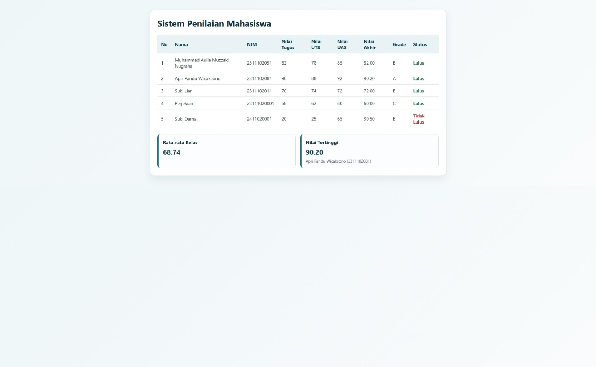

<div align="center">
  <br />
  <h1>LAPORAN PRAKTIKUM <br> APLIKASI BERBASIS PLATFORM </h1>
  <br />
  <h3>MODUL 9 <br> PHP: Buat Sistem Penilaian Mahasiswa </h3>
  <br />
  
  <br />
  <br />
  <br />
  <h3>Disusun Oleh :</h3>
  <p>
    <strong>Muhammad Aulia Muzzaki Nugraha</strong>
    <br>
    <strong>2311102051</strong>
    <br>
    <strong>S1 IF-11-REG05</strong>
  </p>
  <br />
  <h3>Dosen Pengampu :</h3>
  <p>
    <strong>Dedi Agung Prabowo, S.Kom., M.Kom</strong>
  </p>
  <br />
  <br />
  <h4>Asisten Praktikum :</h4>
  <strong>Apri Pandu Wicaksono </strong>
  <br>
  <strong>Hamka Zaenul Ardi</strong>
  <br />
  <h3>LABORATORIUM HIGH PERFORMANCE <br>FAKULTAS INFORMATIKA <br>UNIVERSITAS TELKOM PURWOKERTO <br>2026 </h3>
</div>

<hr>

# Dasar Teori

PHP (Hypertext Preprocessor) adalah bahasa pemrograman sisi server yang banyak digunakan untuk membangun aplikasi web dinamis. Disebut sisi server karena kode PHP diproses di server, kemudian hasil akhirnya dikirim ke browser dalam bentuk HTML, CSS, atau JavaScript. Karena sifatnya yang sederhana namun fleksibel, PHP sering digunakan untuk sistem informasi akademik, portal administrasi, dan aplikasi pengolahan data seperti sistem penilaian mahasiswa.

### 1. Gambaran Umum PHP
1. PHP dirancang untuk pengembangan web dan dapat disisipkan langsung ke dalam dokumen HTML.
2. PHP bersifat interpreted, sehingga script dieksekusi saat ada request dari pengguna.
3. PHP memiliki dukungan luas untuk pengolahan form, manipulasi array, koneksi database, session, dan manajemen file.
4. PHP cocok untuk membangun logika bisnis, seperti perhitungan nilai akhir, konversi nilai angka ke huruf, dan rekap data mahasiswa.

### 2. Alur Kerja PHP pada Aplikasi Web
1. Pengguna mengakses halaman melalui browser.
2. Request dikirim ke web server (contoh: Apache, Nginx, atau built-in server PHP).
3. Server mengeksekusi file PHP.
4. PHP memproses data, menjalankan logika perhitungan, lalu menghasilkan output HTML.
5. Browser menerima hasil output dan menampilkannya ke pengguna.

Alur ini membuat data penting dan proses hitung tetap aman di server karena tidak langsung terlihat pada sisi klien.

### 3. Konsep Dasar PHP yang Digunakan
1. Sintaks Dasar
	- Kode PHP ditulis di dalam tag <?php ... ?>.
	- Setiap pernyataan umumnya diakhiri dengan tanda titik koma.

2. Variabel dan Tipe Data
	- Variabel diawali tanda dolar, misalnya $nama, $nilaiUts.
	- Tipe data yang umum dipakai: string, integer, float, boolean, dan array.

3. Array Asosiatif
	- Data mahasiswa umumnya disimpan sebagai array asosiatif, misalnya:
	  nama, nim, nilai_tugas, nilai_uts, nilai_uas.
	- Bentuk ini memudahkan pemanggilan data berdasarkan kunci.

4. Percabangan (if, elseif, else)
	- Digunakan untuk menentukan kategori nilai huruf berdasarkan nilai akhir.

5. Perulangan (foreach)
	- Digunakan untuk menampilkan data banyak mahasiswa secara otomatis ke tabel.

6. Fungsi
	- Fungsi membantu memecah logika, misalnya fungsi hitungNilaiAkhir() atau fungsi tentukanGrade().
	- Dengan fungsi, kode menjadi lebih rapi, mudah diuji, dan mudah dipelihara.

## Task : PHP: Buat Sistem Penilaian Mahasiswa

### Data
```php
[
	[
		'nama' => 'Muhammad Aulia Muzzaki Nugraha',
		'nim' => '2311102051',
		'nilai_tugas' => 82,
		'nilai_uts' => 78,
		'nilai_uas' => 85,
	],
	[
		'nama' => 'Apri Pandu Wicaksono',
		'nim' => '2311102081',
		'nilai_tugas' => 90,
		'nilai_uts' => 88,
		'nilai_uas' => 92,
	],
	[
		'nama' => 'Suki Liar',
		'nim' => '2311102011',
		'nilai_tugas' => 70,
		'nilai_uts' => 74,
		'nilai_uas' => 72,
	],
	[
		'nama' => 'Perjekian',
		'nim' => '23111020001',
		'nilai_tugas' => 58,
		'nilai_uts' => 62,
		'nilai_uas' => 60,
	],
    [
		'nama' => 'Suki Damai',
		'nim' => '2411020001',
		'nilai_tugas' => 20,
		'nilai_uts' => 25,
		'nilai_uas' => 65,
	],
];
```
Kode Lengkap: [data.php](data.php)
### Source Code index.html
Kode Lengkap: [index.html](index.html)
### Source Code style.css
Kode Lengkap: [style.css](style.css)

### Source Code script.js
Kode Lengkap: [script.js](script.js)


### Screenshot Output



### Penjelasan Program

Program ini menggunakan pola sederhana client-server:
1. Frontend (HTML, CSS, JavaScript) bertugas menampilkan data.
2. Backend (PHP) bertugas mengolah data nilai mahasiswa dan mengirimkannya dalam format JSON.

#### A. Alur Kerja dari Sisi Frontend
1. Saat halaman dibuka, browser memuat `index.html`, kemudian memuat `style.css` untuk tampilan dan `script.js` untuk logika.
2. Di akhir `script.js`, fungsi `loadDataMahasiswa()` langsung dipanggil.
3. Fungsi tersebut melakukan request `fetch("data.php")` untuk mengambil data dari server.
4. Jika request berhasil, data JSON diparsing lalu ditampilkan ke:
	- tabel mahasiswa (`tbody` dengan id `table-body`),
	- ringkasan rata-rata kelas (`#rata-rata`),
	- nilai tertinggi dan pemiliknya (`#nilai-tertinggi`, `#pemilik-tertinggi`).
5. Jika request gagal, tabel diisi pesan error dan elemen `#error-message` ditampilkan.

#### B. Alur Kerja dari Sisi Backend (PHP)
1. File `data.php` menyiapkan data awal mahasiswa dalam array asosiatif (`$mahasiswa`).
2. Program mendefinisikan 3 fungsi utama:
	- `hitungNilaiAkhir()` untuk menghitung nilai akhir berbobot 30% tugas, 30% UTS, 40% UAS.
	- `tentukanGrade()` untuk konversi nilai akhir ke grade A-E.
	- `tentukanStatus()` untuk menentukan status Lulus/Tidak Lulus (batas lulus >= 60).
3. Program melakukan perulangan `foreach` untuk setiap mahasiswa:
	- menghitung nilai akhir,
	- menambahkan `nilai_akhir`, `grade`, dan `status` ke data mahasiswa,
	- menjumlahkan total nilai akhir untuk rata-rata,
	- mengecek apakah nilai saat ini menjadi nilai tertinggi baru.
4. Setelah loop selesai, backend menghitung:
	- `jumlah_mahasiswa`,
	- `rata_rata_kelas`,
	- informasi `nilai_tertinggi` (nilai, nama, nim).
5. Semua data disusun ke dalam array `$response`, lalu dikirim sebagai JSON menggunakan:
	- header `Content-Type: application/json`,
	- `json_encode(...)`.

#### C. Alur Data Keseluruhan
1. User membuka halaman.
2. JavaScript meminta data ke `data.php`.
3. PHP memproses data nilai dan mengembalikan JSON hasil perhitungan.
4. JavaScript menampilkan hasil ke tabel dan kartu ringkasan.
5. User melihat data akhir: nilai per mahasiswa, grade, status, rata-rata kelas, dan nilai tertinggi.

#### D. Ringkasan Logika Perhitungan
1. Rumus nilai akhir:
	- Nilai Akhir = (0.30 x nilai_tugas) + (0.30 x nilai_uts) + (0.40 x nilai_uas)
2. Aturan grade:
	- A: >= 85
	- B: >= 70
	- C: >= 60
	- D: >= 50
	- E: < 50
3. Aturan kelulusan:
	- Lulus jika nilai akhir >= 60
	- Tidak Lulus jika nilai akhir < 60

Dengan alur ini, program sudah memenuhi kebutuhan sistem penilaian sederhana: data terstruktur, perhitungan otomatis, dan hasil ditampilkan rapi pada halaman web.
