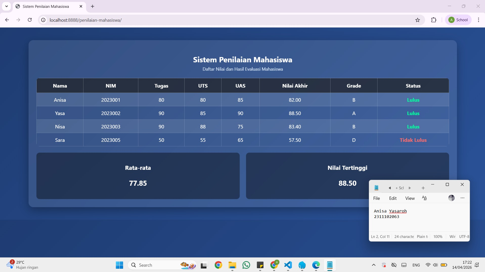

<div align="center">
  <br />
  <h1>LAPORAN PRAKTIKUM <br> APLIKASI BERBASIS PLATFORM </h1>
  <br />
  <h3>MODUL 9 <br> PHP </h3>
  <br />
  
  <br />
  <br />
  <br />
  <h3>Disusun Oleh :</h3>
  <p>
    <strong>Anisa Yasaroh</strong>
    <br>
    <strong>2311102063</strong>
    <br>
    <strong>S1 IF-11-REG05</strong>
  </p>
  <br />
  <h3>Dosen Pengampu :</h3>
  <p>
    <strong>Dedi Agung Prabowo, S.Kom., M.Kom</strong>
  </p>
  <br />
  <br />
  <h4>Asisten Praktikum :</h4>
  <strong>Apri Pandu Wicaksono </strong>
  <br>
  <strong>Hamka Zaenul Ardi</strong>
  <br />
  <h3>LABORATORIUM HIGH PERFORMANCE <br>FAKULTAS INFORMATIKA <br>UNIVERSITAS TELKOM PURWOKERTO <br>2026 </h3>
</div>

<hr>

## Dasar Teori

PHP (Hypertext Preprocessor) adalah bahasa pemrograman server-side scripting yang dikembangkan oleh Rasmus Lerdorf pada tahun 1994. Bahasa ini digunakan untuk membangun halaman web dinamis dengan cara mengeksekusi kode di sisi server sebelum hasilnya dikirim ke browser pengguna. PHP dapat disisipkan langsung ke dalam HTML dengan penulisan kode yang diawali tag `<?php` dan diakhiri `?>`. Dengan mekanisme ini, website mampu menampilkan konten yang berubah-ubah sesuai dengan permintaan pengguna, sehingga lebih interaktif dibandingkan halaman statis. PHP juga berfungsi untuk mengolah data, menghubungkan dengan database, serta menghasilkan output berupa tampilan web yang dinamis.

Array adalah struktur data dalam PHP yang digunakan untuk menyimpan banyak nilai dalam satu variabel. Dalam implementasinya, array dapat berupa array indeks, array asosiatif, maupun array multidimensi. Pada program sistem penilaian mahasiswa, array digunakan untuk menyimpan data mahasiswa seperti nama, NIM, serta nilai tugas, UTS, dan UAS dalam bentuk yang terstruktur. Dengan menggunakan array, data dapat diolah dan ditampilkan secara berulang menggunakan perulangan seperti `foreach`, sehingga proses pengolahan data menjadi lebih efisien dan rapi.

Function (fungsi) dalam PHP adalah sekumpulan kode yang dibuat untuk menjalankan tugas tertentu dan dapat dipanggil berulang kali. Pada program ini, digunakan fungsi seperti `hitungNilaiAkhir()` untuk menghitung nilai akhir mahasiswa dan `getGrade()` untuk menentukan grade berdasarkan nilai. Selain itu, digunakan juga percabangan `if-else` di dalam fungsi untuk menentukan hasil berdasarkan kondisi tertentu, seperti penentuan grade (A, B, C, dan seterusnya) serta status kelulusan. Penggunaan function dan if-else membuat kode lebih terstruktur, mudah dipahami, serta menghindari penulisan kode yang berulang.

## Tugas Modul 9 : Buat Sistem Penilaian Mahasiswa

### Source Code

```
<?php
// 2311102063
// Anisa Yasaroh
// IF-11-REG05

$mahasiswa = [
    ["nama"=>"Anisa","nim"=>"2023001","tugas"=>80,"uts"=>80,"uas"=>85],
    ["nama"=>"Yasa","nim"=>"2023002","tugas"=>90,"uts"=>85,"uas"=>90],
    ["nama"=>"Nisa","nim"=>"2023003","tugas"=>90,"uts"=>88,"uas"=>75],
    ["nama"=>"Sara","nim"=>"2023005","tugas"=>50,"uts"=>55,"uas"=>65]
];

function hitungNilaiAkhir($t,$u,$a){
    return ($t*0.3)+($u*0.3)+($a*0.4);
}

function getGrade($n){
    if($n>=85)return "A";
    elseif($n>=75)return "B";
    elseif($n>=65)return "C";
    elseif($n>=50)return "D";
    else return "E";
}

$totalNilai=0;
$nilaiTertinggi=0;
?>

<!DOCTYPE html>
<html>
<head>
<title>Sistem Penilaian Mahasiswa</title>
<style>
body{
    font-family:'Segoe UI',sans-serif;
    margin:0;
    background: linear-gradient(135deg, #1e3c72, #2a5298);
}

.container{
    width:85%;
    margin:40px auto;
    background: rgba(255,255,255,0.1);
    backdrop-filter: blur(10px);
    padding:25px;
    border-radius:15px;
    box-shadow:0 10px 30px rgba(0,0,0,0.3);
    color:white;
    text-align:center; 
}

h2{
    margin-bottom:5px;
}

.sub{
    text-align:center;
    font-size:14px;
    margin-bottom:20px;
    color:#dbeafe;
}

table{
    width:100%;
    border-collapse: collapse;
    border-radius:10px;
    overflow:hidden;
}

th{
    background:rgba(0,0,0,0.6);
    padding:12px;
    border:1px solid rgba(255,255,255,0.3);
}

td{
    padding:10px;
    text-align:center;
    border:1px solid rgba(255,255,255,0.2);
}

tr:nth-child(even){
    background:rgba(255,255,255,0.1);
}

tr:hover{
    background:rgba(255,255,255,0.2);
}

.lulus{
    color:#00ff9d;
    font-weight:bold;
}

.tidak{
    color:#ff6b6b;
    font-weight:bold;
}

.summary{
    margin-top:20px;
    display:flex;
    gap:20px;
}

.card{
    flex:1;
    background:rgba(0,0,0,0.4);
    padding:15px;
    border-radius:10px;
}

.card p{
    font-size:22px;
    font-weight:bold;
}
</style>
</head>

<body>

<div class="container">
<h2>Sistem Penilaian Mahasiswa</h2>
<div class="sub">Daftar Nilai dan Hasil Evaluasi Mahasiswa</div>

<table>
<tr>
<th>Nama</th>
<th>NIM</th>
<th>Tugas</th>
<th>UTS</th>
<th>UAS</th>
<th>Nilai Akhir</th>
<th>Grade</th>
<th>Status</th>
</tr>

<?php
foreach($mahasiswa as $m){
    $na = hitungNilaiAkhir($m["tugas"],$m["uts"],$m["uas"]);
    $g = getGrade($na);
    $s = ($na >= 60) ? "Lulus" : "Tidak Lulus";

    $totalNilai += $na;
    if($na > $nilaiTertinggi) $nilaiTertinggi = $na;

    $cls = ($s == "Lulus") ? "lulus" : "tidak";

    echo "<tr>
    <td>{$m['nama']}</td>
    <td>{$m['nim']}</td>
    <td>{$m['tugas']}</td>
    <td>{$m['uts']}</td>
    <td>{$m['uas']}</td>
    <td>".number_format($na,2)."</td>
    <td>$g</td>
    <td class='$cls'>$s</td>
    </tr>";
}

$rata = $totalNilai / count($mahasiswa);
?>
</table>

<div class="summary">
<div class="card">
<h3>Rata-rata</h3>
<p><?=number_format($rata,2)?></p>
</div>

<div class="card">
<h3>Nilai Tertinggi</h3>
<p><?=number_format($nilaiTertinggi,2)?></p>
</div>
</div>

</div>

</body>
</html>
```
### Screenshot Output


### Penjelasan Code

Program tersebut digunakan untuk mengolah data mahasiswa dengan menghitung nilai akhir, menentukan grade, dan status kelulusan, kemudian menampilkannya dalam bentuk tabel HTML. Pada bagian awal, didefinisikan sebuah array multidimensi `$mahasiswa` yang berisi data beberapa mahasiswa, seperti nama, NIM, nilai tugas, UTS, dan UAS. Struktur array ini menggunakan array asosiatif sehingga setiap data dapat diakses menggunakan key seperti `"nama"` dan `"nim"`. Data ini kemudian akan diproses menggunakan perulangan untuk ditampilkan ke halaman web.

Selanjutnya, terdapat dua fungsi utama yaitu `hitungNilaiAkhir()` dan `getGrade()`. Fungsi `hitungNilaiAkhir()` digunakan untuk menghitung nilai akhir mahasiswa berdasarkan bobot nilai tugas (30%), UTS (30%), dan UAS (40%). Sedangkan fungsi `getGrade()` digunakan untuk menentukan grade (A, B, C, D, E) berdasarkan nilai akhir dengan menggunakan percabangan `if-else`. Selain itu, status kelulusan ditentukan menggunakan operator perbandingan dengan batas nilai ≥ 60 dinyatakan lulus.

Data mahasiswa kemudian ditampilkan menggunakan perulangan `foreach`, di mana setiap data dihitung nilai akhirnya, ditentukan gradenya, serta status kelulusannya. Hasil tersebut ditampilkan dalam bentuk tabel HTML menggunakan perintah `echo`. Program juga menghitung nilai rata-rata kelas dan nilai tertinggi dengan menggunakan variabel `$totalNilai` dan `$nilaiTertinggi`, lalu ditampilkan dalam bentuk card di bagian bawah tabel. Program ini dijalankan pada server lokal dan dapat diakses melalui browser pada alamat `http://localhost:8888/penilaian-mahasiswa/` sehingga hasil pengolahan data dapat ditampilkan.