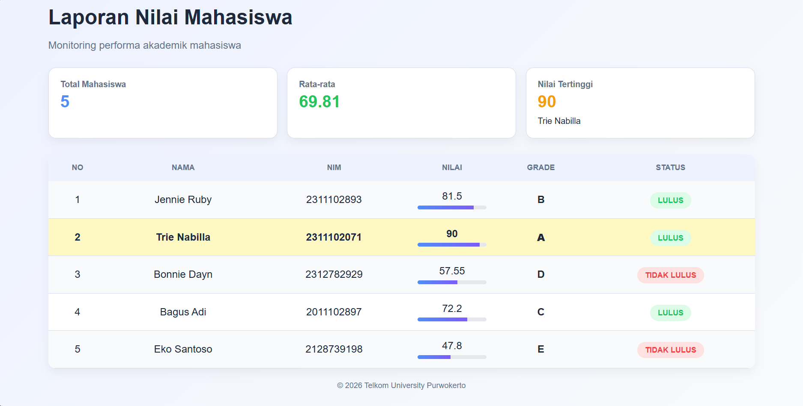

<div align="center">
  <br />
  <h1>LAPORAN PRAKTIKUM <br> APLIKASI BERBASIS PLATFORM </h1>
  <br />
  <h3>MODUL 9 <br> PHP </h3>
  <br />
  
  <br />
  <br />
  <br />
  <h3>Disusun Oleh :</h3>
  <p>
    <strong>Trie Nabilla Farhah</strong>
    <br>
    <strong>2311102071</strong>
    <br>
    <strong>S1 IF-11-REG05</strong>
  </p>
  <br />
  <h3>Dosen Pengampu :</h3>
  <p>
    <strong>Dedi Agung Prabowo, S.Kom., M.Kom</strong>
  </p>
  <br />
  <br />
  <h4>Asisten Praktikum :</h4>
  <strong>Apri Pandu Wicaksono </strong>
  <br>
  <strong>Hamka Zaenul Ardi</strong>
  <br />
  <h3>LABORATORIUM HIGH PERFORMANCE <br>FAKULTAS INFORMATIKA <br>UNIVERSITAS TELKOM PURWOKERTO <br>2026 </h3>
</div>

<hr>

## Dasar Teori

PHP (Hypertext Preprocessor) adalah bahasa pemrograman yang berjalan di sisi server (server-side) dan digunakan untuk membangun website dinamis. Artinya, kode PHP tidak dijalankan di browser pengguna, melainkan di server, kemudian hasilnya dikirim dalam bentuk HTML. Dengan PHP, pengembang dapat membuat berbagai fitur interaktif seperti sistem login, pengolahan formulir, manajemen data, hingga integrasi dengan layanan lain. Karena sifatnya yang fleksibel, PHP banyak digunakan dalam pengembangan website skala kecil hingga besar.

Salah satu keunggulan utama PHP adalah kemampuannya dalam berintegrasi dengan database seperti MySQL. Melalui PHP, data dapat disimpan, diambil, diperbarui, dan dihapus menggunakan query SQL. Hal ini membuat PHP sangat cocok digunakan dalam pembuatan aplikasi berbasis web seperti sistem informasi akademik, e-commerce, dan aplikasi manajemen. Selain itu, PHP memiliki banyak library dan framework seperti Laravel dan CodeIgniter yang membantu mempercepat proses pengembangan serta meningkatkan keamanan dan struktur kode.

PHP juga bersifat open-source, sehingga dapat digunakan secara gratis dan memiliki komunitas yang sangat besar. Bahasa ini mudah dipelajari karena sintaksnya sederhana dan mirip dengan bahasa C atau Java. PHP dapat dijalankan di berbagai sistem operasi seperti Windows, Linux, dan macOS, serta didukung oleh berbagai web server seperti Apache dan Nginx. Dengan dukungan dokumentasi yang lengkap dan komunitas yang aktif, PHP menjadi salah satu pilihan populer bagi pengembang web di seluruh dunia.

## Tugas Modul 9 : Buat Sistem Penilaian Mahasiswa

### Source Code

```
<?php
// 2311102071
// Trie Nabilla Farhah
// IF-11-REG05

<?php

// ==============================
// DATA MAHASISWA
// ==============================
$mahasiswa = [
    [
        "nama"         => "Jennie Ruby",
        "nim"          => "2311102893",
        "nilai_tugas"  => 85,
        "nilai_uts"    => 78,
        "nilai_uas"    => 82,
    ],
    [
        "nama"         => "Trie Nabilla",
        "nim"          => "2311102071",
        "nilai_tugas"  => 90,
        "nilai_uts"    => 92,
        "nilai_uas"    => 88,
    ],
    [
        "nama"         => "Bonnie Dayn",
        "nim"          => "2312782929",
        "nilai_tugas"  => 60,
        "nilai_uts"    => 55,
        "nilai_uas"    => 58,
    ],
    [
        "nama"         => "Bagus Adi",
        "nim"          => "2011102897",
        "nilai_tugas"  => 75,
        "nilai_uts"    => 70,
        "nilai_uas"    => 72,
    ],
    [
        "nama"         => "Eko Santoso",
        "nim"          => "2128739198",
        "nilai_tugas"  => 45,
        "nilai_uts"    => 50,
        "nilai_uas"    => 48,
    ],
];

// ==============================
// FUNCTION
// ==============================

// Hitung nilai akhir
function hitungNilaiAkhir($tugas, $uts, $uas)
{
    return round(($tugas * 0.30) + ($uts * 0.35) + ($uas * 0.35), 2);
}

// Tentukan grade
function tentukanGrade($nilai)
{
    if ($nilai >= 85) return "A";
    elseif ($nilai >= 75) return "B";
    elseif ($nilai >= 65) return "C";
    elseif ($nilai >= 55) return "D";
    else return "E";
}

// Tentukan status
function tentukanStatus($nilai)
{
    return ($nilai >= 60) ? "LULUS" : "TIDAK LULUS";
}

// ==============================
// PROSES DATA
// ==============================
$total_nilai      = 0;
$nilai_tertinggi  = 0;
$nama_tertinggi   = "";

foreach ($mahasiswa as &$mhs) {
    $mhs["nilai_akhir"] = hitungNilaiAkhir(
        $mhs["nilai_tugas"],
        $mhs["nilai_uts"],
        $mhs["nilai_uas"]
    );

    $mhs["grade"]  = tentukanGrade($mhs["nilai_akhir"]);
    $mhs["status"] = tentukanStatus($mhs["nilai_akhir"]);

    $total_nilai += $mhs["nilai_akhir"];

    if ($mhs["nilai_akhir"] > $nilai_tertinggi) {
        $nilai_tertinggi = $mhs["nilai_akhir"];
        $nama_tertinggi  = $mhs["nama"];
    }
}
unset($mhs);

$jumlah_mahasiswa = count($mahasiswa);
$rata_rata        = round($total_nilai / $jumlah_mahasiswa, 2);

?>

<!DOCTYPE html>
<html lang="id">
<head>
    <meta charset="UTF-8">
    <title>Laporan Nilai Mahasiswa</title>

    <style>
        :root {
            --bg: #f5f7fb;
            --card: #ffffff;
            --border: #d6dceb;
            --text: #1e293b;
            --muted: #64748b;
            --blue: #4f8ef7;
            --green: #22c55e;
            --red: #ef4444;
            --yellow: #f59e0b;
        }

        body {
            background: linear-gradient(135deg, #eef2ff, #f8fafc);
            font-family: Arial, sans-serif;
            padding: 30px;
            color: var(--text);
        }

        .container {
            max-width: 1100px;
            margin: auto;
        }

        /* HEADER */
        .header {
            margin-bottom: 25px;
        }

        .header h1 {
            font-size: 32px;
            margin: 0;
        }

        .header p {
            color: var(--muted);
        }

        /* STATS */
        .stats {
            display: grid;
            grid-template-columns: repeat(auto-fit, minmax(200px, 1fr));
            gap: 15px;
            margin-bottom: 25px;
        }

        .card {
            background: var(--card);
            padding: 18px;
            border-radius: 12px;
            border: 1px solid var(--border);
            box-shadow: 0 6px 15px rgba(0,0,0,0.05);
            transition: 0.3s;
        }

        .card:hover {
            transform: translateY(-5px);
        }

        .card h3 {
            font-size: 13px;
            color: var(--muted);
            margin: 0;
        }

        .card p {
            font-size: 26px;
            font-weight: bold;
            margin: 5px 0;
        }

        .blue   { color: var(--blue); }
        .green  { color: var(--green); }
        .yellow { color: var(--yellow); }

        /* TABLE */
        .table-box {
            background: var(--card);
            border-radius: 12px;
            overflow: hidden;
            box-shadow: 0 6px 15px rgba(0,0,0,0.05);
        }

        table {
            width: 100%;
            border-collapse: collapse;
        }

        th {
            background: #eef2ff;
            padding: 14px;
            font-size: 12px;
            text-transform: uppercase;
            color: var(--muted);
        }

        td {
            padding: 14px;
            border-bottom: 1px solid var(--border);
            text-align: center;
        }

        tr:nth-child(even) {
            background: #f8fafc;
        }

        tr:hover {
            background: #e0e7ff;
        }

        /* PROGRESS BAR */
        .bar {
            height: 6px;
            background: #e5e7eb;
            border-radius: 5px;
            margin-top: 5px;
            overflow: hidden;
        }

        .fill {
            height: 100%;
            background: linear-gradient(90deg, #4f8ef7, #7c5cf7);
        }

        /* BADGE */
        .badge {
            padding: 6px 12px;
            border-radius: 20px;
            font-size: 12px;
            font-weight: bold;
        }

        .lulus {
            background: #dcfce7;
            color: var(--green);
        }

        .tidak {
            background: #fee2e2;
            color: var(--red);
        }

        /* TOP STUDENT */
        .top {
            background: #fef9c3 !important;
            font-weight: bold;
        }

        .footer {
            text-align: center;
            margin-top: 20px;
            font-size: 12px;
            color: var(--muted);
        }
    </style>
</head>

<body>

<div class="container">

    <!-- HEADER -->
    <div class="header">
        <h1>Laporan Nilai Mahasiswa</h1>
        <p>Monitoring performa akademik mahasiswa</p>
    </div>

    <!-- STATISTIK -->
    <div class="stats">
        <div class="card">
            <h3>Total Mahasiswa</h3>
            <p class="blue"><?= $jumlah_mahasiswa ?></p>
        </div>

        <div class="card">
            <h3>Rata-rata</h3>
            <p class="green"><?= $rata_rata ?></p>
        </div>

        <div class="card">
            <h3>Nilai Tertinggi</h3>
            <p class="yellow"><?= $nilai_tertinggi ?></p>
            <small><?= $nama_tertinggi ?></small>
        </div>
    </div>

    <!-- TABEL -->
    <div class="table-box">
        <table>
            <tr>
                <th>No</th>
                <th>Nama</th>
                <th>NIM</th>
                <th>Nilai</th>
                <th>Grade</th>
                <th>Status</th>
            </tr>

            <?php foreach ($mahasiswa as $index => $mhs): ?>
                <tr class="<?= ($mhs["nilai_akhir"] == $nilai_tertinggi) ? 'top' : '' ?>">
                    <td><?= $index + 1 ?></td>
                    <td>
                        <?= $mhs["nama"] ?>
                    </td>
                    <td><?= $mhs["nim"] ?></td>

                    <td>
                        <?= $mhs["nilai_akhir"] ?>
                        <div class="bar">
                            <div class="fill" style="width: <?= $mhs["nilai_akhir"] ?>%;"></div>
                        </div>
                    </td>

                    <td><strong><?= $mhs["grade"] ?></strong></td>

                    <td>
                        <span class="badge <?= ($mhs["status"] === "LULUS") ? 'lulus' : 'tidak' ?>">
                            <?= $mhs["status"] ?>
                        </span>
                    </td>
                </tr>
            <?php endforeach; ?>

        </table>
    </div>

    <div class="footer">
        © <?= date("Y") ?> Telkom University Purwokerto
    </div>

</div>

</body>
</html>
```
### Screenshot Output


### Penjelasan Code

Program ini diawali dengan pendefinisian data mahasiswa menggunakan **array asosiatif**, di mana setiap elemen array menyimpan informasi seperti nama, NIM, nilai tugas, nilai UTS, dan nilai UAS. Setelah itu, dibuat beberapa **function** untuk memisahkan logika program agar lebih terstruktur. Function `hitungNilaiAkhir()` digunakan untuk menghitung nilai akhir berdasarkan bobot yang telah ditentukan menggunakan operator aritmatika, yaitu 30% tugas, 35% UTS, dan 35% UAS. Kemudian, function `tentukanGrade()` menggunakan percabangan **if-else** untuk mengelompokkan nilai ke dalam grade A sampai E. Selain itu, function `tentukanStatus()` memanfaatkan operator perbandingan untuk menentukan apakah mahasiswa lulus atau tidak dengan batas minimal nilai 60.

Selanjutnya, program melakukan proses pengolahan data menggunakan perulangan **foreach** untuk mengakses setiap data mahasiswa. Di dalam perulangan ini, program memanggil function yang telah dibuat untuk menghitung nilai akhir, menentukan grade, dan status, kemudian hasilnya disimpan kembali ke dalam array mahasiswa. Pada tahap ini juga dilakukan perhitungan statistik, yaitu menjumlahkan seluruh nilai akhir untuk mendapatkan rata-rata kelas, serta membandingkan nilai setiap mahasiswa untuk menemukan nilai tertinggi dan menyimpan nama mahasiswa yang bersangkutan.

Terakhir, hasil pengolahan data ditampilkan menggunakan **HTML yang dikombinasikan dengan PHP (embedded PHP)** dalam bentuk tabel. Struktur tabel menampilkan data seperti nomor, nama, NIM, nilai akhir, grade, dan status kelulusan. Selain itu, ditampilkan juga informasi tambahan berupa jumlah mahasiswa, rata-rata nilai kelas, dan nilai tertinggi. Tampilan diperindah menggunakan CSS agar lebih modern dan mudah dibaca, termasuk penggunaan warna, tabel responsif, serta elemen visual seperti progress bar dan badge status. Dengan demikian, program ini menunjukkan implementasi konsep dasar PHP secara lengkap mulai dari pengolahan data hingga penyajian hasil secara dinamis.
