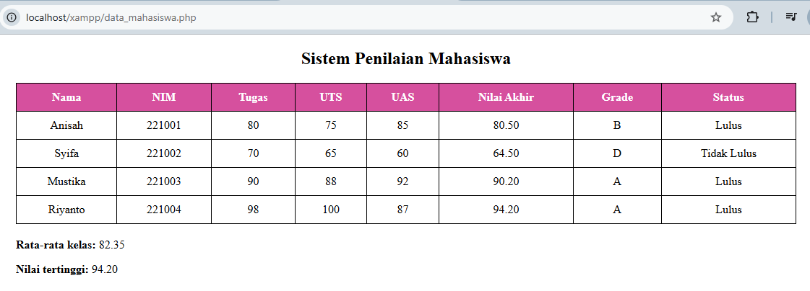

<div align="center">
  <br />
  <h1>LAPORAN PRAKTIKUM <br> APLIKASI BERBASIS PLATFORM </h1>
  <br />
  <h3>MODUL 9 <br> PHP </h3>
  <br />
  
  <br />
  <br />
  <br />
  <h3>Disusun Oleh :</h3>
  <p>
    <strong>Anisah Syifa Mustika Riyanto</strong>
    <br>
    <strong>2311102080</strong>
    <br>
    <strong>S1 IF-11-05</strong>
  </p>
  <br />
  <h3>Dosen Pengampu :</h3>
  <p>
    <strong>Dedi Agung Prabowo, S.Kom., M.Kom</strong>
  </p>
  <br />
  <br />
  <h4>Asisten Praktikum :</h4>
  <strong>Apri Pandu Wicaksono </strong>
  <br>
  <strong>Hamka Zaenul Ardi</strong>
  <br />
  <h3>LABORATORIUM HIGH PERFORMANCE <br>FAKULTAS INFORMATIKA <br>UNIVERSITAS TELKOM PURWOKERTO <br>2026</h3>
</div>

<hr>

## Dasar Teori PHP

### 1. Pengertian PHP

PHP (Hypertext Preprocessor) merupakan bahasa pemrograman yang digunakan untuk membangun aplikasi berbasis web dan bersifat _server-side_. Artinya, proses eksekusi kode dilakukan di server, kemudian hasilnya dikirim ke browser dalam bentuk HTML.

---

### 2. Karakteristik PHP

PHP memiliki beberapa karakteristik utama, yaitu:

- Bersifat open-source (gratis digunakan)
- Mudah dipelajari dan digunakan
- Dapat dijalankan di berbagai sistem operasi
- Terintegrasi dengan database seperti MySQL
- Mendukung pembuatan web dinamis

---

### 3. Sintaks Dasar PHP

Kode PHP dituliskan di dalam tag khusus:

```php
<?php
// kode PHP di sini
?>
```

Setiap perintah biasanya diakhiri dengan tanda titik koma (;).

---

### 4. Variabel dalam PHP

Variabel digunakan untuk menyimpan data dan diawali dengan tanda `$`.
Contoh:

```php
$nama = "Aldi";
$nilai = 80;
```

---

### 5. Array dalam PHP

Array digunakan untuk menyimpan banyak data dalam satu variabel.
Pada modul ini digunakan **array asosiatif**, yaitu array dengan pasangan _key-value_.

Contoh:

```php
$mahasiswa = [
    "nama" => "Aldi",
    "nim" => "221001"
];
```

---

### 6. Operator dalam PHP

#### a. Operator Aritmatika

Digunakan untuk perhitungan matematis:

- `+` (penjumlahan)
- `-` (pengurangan)
- `*` (perkalian)
- `/` (pembagian)

#### b. Operator Perbandingan

Digunakan untuk membandingkan nilai:

- `==` (sama dengan)
- `>=` (lebih besar sama dengan)
- `<=` (lebih kecil sama dengan)

---

### 7. Percabangan (Conditional Statement)

Digunakan untuk pengambilan keputusan berdasarkan kondisi.

Contoh:

```php
if ($nilai >= 70) {
    echo "Lulus";
} else {
    echo "Tidak Lulus";
}
```

---

### 8. Perulangan (Looping)

Digunakan untuk menjalankan kode secara berulang.
Pada modul ini digunakan `foreach` untuk menampilkan data array.

Contoh:

```php
foreach ($mahasiswa as $mhs) {
    echo $mhs['nama'];
}
```

---

### 9. Function (Fungsi)

Function digunakan untuk mengelompokkan kode agar lebih rapi dan dapat digunakan kembali.

Contoh:

```php
function hitungNilai($tugas, $uts, $uas) {
    return ($tugas + $uts + $uas) / 3;
}
```

---

### 10. Integrasi PHP dengan HTML

PHP dapat digabungkan dengan HTML untuk menampilkan data secara dinamis, misalnya dalam bentuk tabel. Hal ini memungkinkan data dari program dapat ditampilkan dengan tampilan yang lebih terstruktur.

## Tugas 9 - Buat Sistem Penilaian Mahasiswa

### Source Code

```
<?php
$mahasiswa = [
    [
        "nama" => "Anisah",
        "nim" => "221001",
        "tugas" => 80,
        "uts" => 75,
        "uas" => 85
    ],
    [
        "nama" => "Syifa",
        "nim" => "221002",
        "tugas" => 70,
        "uts" => 65,
        "uas" => 60
    ],
    [
        "nama" => "Mustika",
        "nim" => "221003",
        "tugas" => 90,
        "uts" => 88,
        "uas" => 92
    ],
    [
        "nama" => "Riyanto",
        "nim" => "221004",
        "tugas" => 98,
        "uts" => 100,
        "uas" => 87
    ]
];

function hitungNilaiAkhir($tugas, $uts, $uas) {
    return ($tugas * 0.3) + ($uts * 0.3) + ($uas * 0.4);
}

function getGrade($nilai) {
    if ($nilai >= 85) return "A";
    elseif ($nilai >= 75) return "B";
    elseif ($nilai >= 65) return "C";
    elseif ($nilai >= 50) return "D";
    else return "E";
}

function getStatus($nilai) {
    return ($nilai >= 70) ? "Lulus" : "Tidak Lulus";
}

$totalNilai = 0;
$nilaiTertinggi = 0;
?>

<!DOCTYPE html>
<html>
<head>
    <title>Sistem Penilaian Mahasiswa</title>
    <style>
        table {
            border-collapse: collapse;
            width: 80%;
            margin: 20px auto;
            text-align: center;
        }
        th, td {
            border: 1px solid black;
            padding: 10px;
        }
        th {
            background-color: #d6509e;
            color: white;
        }
    </style>
</head>
<body>

<h2 style="text-align:center;">Sistem Penilaian Mahasiswa</h2>

<table>
    <tr>
        <th>Nama</th>
        <th>NIM</th>
        <th>Tugas</th>
        <th>UTS</th>
        <th>UAS</th>
        <th>Nilai Akhir</th>
        <th>Grade</th>
        <th>Status</th>
    </tr>

    <?php foreach ($mahasiswa as $mhs):
        $nilaiAkhir = hitungNilaiAkhir($mhs['tugas'], $mhs['uts'], $mhs['uas']);
        $grade = getGrade($nilaiAkhir);
        $status = getStatus($nilaiAkhir);

        $totalNilai += $nilaiAkhir;
        if ($nilaiAkhir > $nilaiTertinggi) {
            $nilaiTertinggi = $nilaiAkhir;
        }
    ?>
    <tr>
        <td><?= $mhs['nama']; ?></td>
        <td><?= $mhs['nim']; ?></td>
        <td><?= $mhs['tugas']; ?></td>
        <td><?= $mhs['uts']; ?></td>
        <td><?= $mhs['uas']; ?></td>
        <td><?= number_format($nilaiAkhir, 2); ?></td>
        <td><?= $grade; ?></td>
        <td><?= $status; ?></td>
    </tr>
    <?php endforeach; ?>
</table>

<?php
$rataRata = $totalNilai / count($mahasiswa);
?>

<div style="width:80%; margin:auto;">
    <p><b>Rata-rata kelas:</b> <?= number_format($rataRata, 2); ?></p>
    <p><b>Nilai tertinggi:</b> <?= number_format($nilaiTertinggi, 2); ?></p>
</div>

</body>
</html>
```

### Hasil Output



### Deskripsi Kode

Pada bagian awal program, dibuat sebuah array asosiatif yang berisi data beberapa mahasiswa, meliputi nama, NIM, nilai tugas, nilai UTS, dan nilai UAS. Data ini disimpan dalam bentuk array multidimensi sehingga dapat menampung lebih dari satu mahasiswa.

Selanjutnya, program mendefinisikan beberapa function yang digunakan untuk mengolah data. Fungsi hitungNilaiAkhir() digunakan untuk menghitung nilai akhir mahasiswa berdasarkan bobot tertentu, yaitu 30% nilai tugas, 30% nilai UTS, dan 40% nilai UAS. Kemudian, fungsi getGrade() digunakan untuk menentukan grade berdasarkan nilai akhir dengan menggunakan percabangan if/else. Selain itu, terdapat fungsi getStatus() yang berfungsi untuk menentukan apakah mahasiswa dinyatakan lulus atau tidak berdasarkan nilai minimum kelulusan.

Pada bagian berikutnya, program melakukan proses perulangan menggunakan foreach untuk menampilkan seluruh data mahasiswa. Di dalam perulangan tersebut, setiap data mahasiswa diproses untuk dihitung nilai akhirnya, kemudian ditentukan grade dan status kelulusannya. Hasil dari proses tersebut ditampilkan ke dalam tabel HTML secara terstruktur, dengan kolom yang terdiri dari nama, NIM, nilai tugas, nilai UTS, nilai UAS, nilai akhir, grade, dan status.

Selain menampilkan data, program juga melakukan perhitungan tambahan yaitu menghitung total nilai untuk mendapatkan rata-rata kelas, serta mencari nilai tertinggi dari seluruh mahasiswa. Nilai total akan dijumlahkan selama proses perulangan berlangsung, kemudian dibagi dengan jumlah mahasiswa untuk memperoleh rata-rata. Sedangkan nilai tertinggi diperoleh dengan membandingkan setiap nilai akhir dan menyimpan nilai terbesar.

Secara keseluruhan, program ini mampu mengelola data mahasiswa, melakukan perhitungan nilai secara otomatis, serta menampilkan hasil dalam bentuk yang rapi dan mudah dipahami. Kombinasi antara PHP dan HTML memungkinkan pembuatan aplikasi sederhana yang bersifat dinamis dan informatif.
