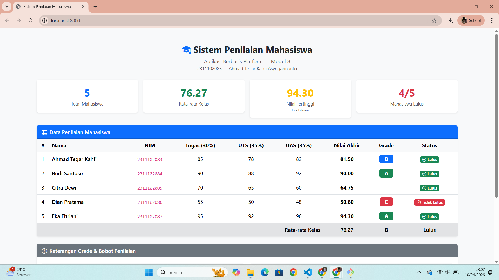

<div align="center">
  <br />
  <h1>LAPORAN PRAKTIKUM <br> APLIKASI BERBASIS PLATFORM </h1>
  <br />
  <h3>MODUL 8 <br> PHP </h3>
  <br />
  
  <br />
  <br />
  <br />
  <h3>Disusun Oleh :</h3>
  <p>
    <strong>Ahmad Tegar Kahfi Asyngarinanto</strong>
    <br>
    <strong>2311102083</strong>
    <br>
    <strong>S1 IF-11-REG05</strong>
  </p>
  <br />
  <h3>Dosen Pengampu :</h3>
  <p>
    <strong>Dedi Agung Prabowo, S.Kom., M.Kom</strong>
  </p>
  <br />
  <br />
  <h4>Asisten Praktikum :</h4>
  <strong>Apri Pandu Wicaksono</strong>
  <br>
  <strong>Hamka Zaenul Ardi</strong>
  <br />
  <h3>LABORATORIUM HIGH PERFORMANCE <br>FAKULTAS INFORMATIKA <br>UNIVERSITAS TELKOM PURWOKERTO <br>2026 </h3>
</div>

<hr>

# Dasar Teori

## 1. PHP

PHP (*Hypertext Preprocessor*) adalah bahasa pemrograman server-side yang dirancang khusus untuk pengembangan web. Kode PHP dieksekusi di server, dan hasilnya dikirim ke browser dalam bentuk HTML. PHP bisa disisipkan langsung di dalam HTML menggunakan tag `<?php ... ?>`.

---

## 2. Array Asosiatif

Array asosiatif adalah array yang menggunakan string sebagai key, bukan indeks angka. Ini sangat berguna untuk menyimpan data terstruktur seperti data mahasiswa.

```php
$mahasiswa = [
    "nama"        => "Ahmad Tegar",
    "nim"         => "2311102083",
    "nilai_tugas" => 85,
    "nilai_uts"   => 78,
    "nilai_uas"   => 82,
];
```

---

## 3. Function

Function digunakan untuk membungkus logika yang bisa dipakai berulang kali. Pada program ini, function digunakan untuk menghitung nilai akhir, menentukan grade, dan menentukan status kelulusan.

```php
function hitungNilaiAkhir($tugas, $uts, $uas) {
    return ($tugas * 0.30) + ($uts * 0.35) + ($uas * 0.35);
}
```

---

## 4. Operator Aritmatika

Digunakan untuk perhitungan nilai akhir dengan bobot masing-masing komponen:

| Operator | Fungsi | Contoh |
|----------|--------|--------|
| `*` | Perkalian | `$tugas * 0.30` |
| `+` | Penjumlahan | `$a + $b + $c` |
| `/` | Pembagian | `$total / count($data)` |

---

## 5. Operator Perbandingan & If/Else

Digunakan untuk menentukan grade dan status kelulusan berdasarkan nilai akhir.

```php
// Menentukan grade
if ($nilai >= 85) {
    return "A";
} elseif ($nilai >= 75) {
    return "B";
} elseif ($nilai >= 65) {
    return "C";
} elseif ($nilai >= 55) {
    return "D";
} else {
    return "E";
}

// Ternary operator untuk status lulus
return $nilai >= 60 ? "Lulus" : "Tidak Lulus";
```

---

## 6. Loop (Foreach)

Loop `foreach` digunakan untuk mengiterasi seluruh data mahasiswa dalam array, memproses nilai, dan menampilkannya ke tabel HTML.

```php
foreach ($mahasiswa as $mhs) {
    echo "<tr>";
    echo "<td>" . $mhs["nama"] . "</td>";
    echo "</tr>";
}
```

---

# Tugas 9 — Sistem Penilaian Mahasiswa

## Cara Menjalankan

Program ini membutuhkan PHP untuk dijalankan. Ada dua cara:

**Menggunakan PHP Built-in Server:**
```bash
php -S localhost:8000
```
Lalu buka `http://localhost:8000/penilaian.php` di browser.

**Menggunakan XAMPP/Laragon:**
Taruh file `penilaian.php` di folder `htdocs` lalu akses via browser.

---

## Rumus Nilai Akhir

```
Nilai Akhir = (Tugas × 30%) + (UTS × 35%) + (UAS × 35%)
```

## Ketentuan Grade

| Grade | Rentang | Keterangan |
|-------|---------|------------|
| A | 85 – 100 | Sangat Baik |
| B | 75 – 84 | Baik |
| C | 65 – 74 | Cukup |
| D | 55 – 64 | Kurang |
| E | 0 – 54 | Tidak Lulus |

Batas kelulusan: **Nilai Akhir ≥ 60**

## Code

```php
<?php
// Array asosiatif data mahasiswa
$mahasiswa = [
    [
        "nama"        => "Ahmad Tegar Kahfi",
        "nim"         => "2311102083",
        "nilai_tugas" => 85,
        "nilai_uts"   => 78,
        "nilai_uas"   => 82,
    ],
    // ... (lihat file penilaian.php untuk data lengkap)
];

// Function hitung nilai akhir
function hitungNilaiAkhir($tugas, $uts, $uas) {
    return ($tugas * 0.30) + ($uts * 0.35) + ($uas * 0.35);
}

// Function tentukan grade
function tentukanGrade($nilai) {
    if ($nilai >= 85)      return "A";
    elseif ($nilai >= 75)  return "B";
    elseif ($nilai >= 65)  return "C";
    elseif ($nilai >= 55)  return "D";
    else                   return "E";
}

// Function tentukan status
function tentukanStatus($nilai) {
    return $nilai >= 60 ? "Lulus" : "Tidak Lulus";
}

// Loop proses data
foreach ($mahasiswa as &$mhs) {
    $mhs["nilai_akhir"] = hitungNilaiAkhir(
        $mhs["nilai_tugas"], $mhs["nilai_uts"], $mhs["nilai_uas"]
    );
    $mhs["grade"]  = tentukanGrade($mhs["nilai_akhir"]);
    $mhs["status"] = tentukanStatus($mhs["nilai_akhir"]);
}
?>
```

> Kode lengkap tersedia di file `penilaian.php`

## Output


