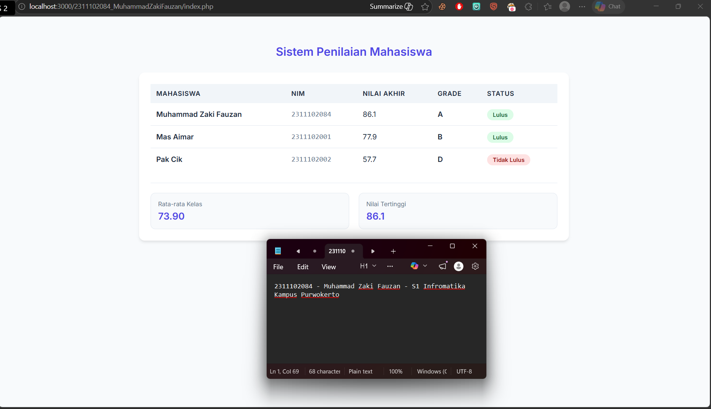

<div align="center">
    <br />
    <h1>LAPORAN PRAKTIKUM <br> APLIKASI BERBASIS PLATFORM </h1>
    <br />
    <h3>MODUL 9 <br> PHP </h3>
    <br />
    
    <br />
    <br />
    <br />
    <h3>Disusun Oleh :</h3>
    <p>
        <strong>Muhammad Zaki Fauzan</strong>
        <br>
        <strong>2311102084</strong>
        <br>
        <strong>S1 IF-11-REG05</strong>
    </p>
    <br />
    <h3>Dosen Pengampu :</h3>
    <p>
        <strong>Dedi Agung Prabowo, S.Kom., M.Kom</strong>
    </p>
    <br />
    <br />
    <h4>Asisten Praktikum :</h4>
    <strong>Apri Pandu Wicaksono </strong>
    <br>
    <strong>Hamka Zaenul Ardi</strong>
    <br />
    <h3>LABORATORIUM HIGH PERFORMANCE <br>FAKULTAS INFORMATIKA <br>UNIVERSITAS TELKOM PURWOKERTO <br>2026 </h3>
</div>
<hr>

## Dasar Teori

Dalam pengerjaan modul kali ini, konsep utama yang diterapkan adalah penggunaan PHP sebagai bahasa pemrograman server-side untuk mengolah data dinamis. Penggunaan array asosiatif menjadi poin penting karena memungkinkan penyimpanan data mahasiswa (seperti Nama, NIM, dan Nilai) dalam satu variabel namun tetap terstruktur menggunakan kunci (key) yang deskriptif. Logika pemrograman dibangun menggunakan fungsi (function) khusus untuk menghitung akumulasi nilai berdasarkan bobot persentase tertentu, yang kemudian hasilnya diolah melalui struktur kontrol percabangan (if/else) untuk menentukan grade serta status kelulusan mahasiswa berdasarkan ambang batas yang sudah ditetapkan.

Selain logika perhitungan, program ini juga menerapkan perulangan (looping), khususnya foreach, untuk mengekstrak isi array dan menampilkannya secara otomatis ke dalam baris-baris tabel HTML. Dari sisi presentasi data, integrasi CSS dilakukan untuk meningkatkan pengalaman pengguna (UI/UX) agar informasi statistik, seperti rata-rata kelas dan nilai tertinggi, dapat dibaca dengan lebih jelas dan profesional. Secara keseluruhan, sistem ini mendemonstrasikan bagaimana PHP dapat digunakan untuk memproses logika aritmatika dan perbandingan secara efisien sebelum hasilnya dikirimkan ke sisi klien (browser).

## Tugas Modul 9 - PHP: Buat Sistem Penilaian Mahasiswa

### Source Code

```php
<?php
/**
 * Tugas Modul 9 - PHP: Sistem Penilaian Mahasiswa
 * Nama : Muhammad Zaki Fauzan
 * NIM  : 2311102084
 */
$daftar_mahasiswa = [
    [
        "nama" => "Muhammad Zaki Fauzan",
        "nim" => "2311102084",
        "tugas" => 85,
        "uts" => 82,
        "uas" => 90
    ],
    [
        "nama" => "Mas Aimar",
        "nim" => "2311102001",
        "tugas" => 78,
        "uts" => 75,
        "uas" => 80
    ],
    [
        "nama" => "Pak Cik",
        "nim" => "2311102002",
        "tugas" => 60,
        "uts" => 55,
        "uas" => 58
    ]
];

function hitungNilaiAkhir($tugas, $uts, $uas) {
    return ($tugas * 0.3) + ($uts * 0.3) + ($uas * 0.4);
}

function tentukanGrade($nilai) {
    if ($nilai >= 80) return "A";
    elseif ($nilai >= 70) return "B";
    elseif ($nilai >= 60) return "C";
    elseif ($nilai >= 50) return "D";
    else return "E";
}

$total_nilai_kelas = 0;
$nilai_tertinggi = 0;
?>
```

**Kode Lengkap:** [index.php](index.php)

Output:


### Penjelasan

Program ini bekerja dengan menyimpan data mahasiswa ke dalam array asosiatif agar informasi seperti NIM dan nilai bisa diakses dengan kunci yang jelas. Logika utamanya terletak pada penggunaan function untuk menghitung nilai akhir secara otomatis berdasarkan bobot persentase, serta percabangan (if-else) untuk menentukan grade dan status kelulusan. Semua data tersebut kemudian diproses menggunakan perulangan (foreach) agar bisa tampil secara dinamis ke dalam tabel HTML, lengkap dengan perhitungan rata-rata dan nilai tertinggi untuk ringkasan statistik kelas.