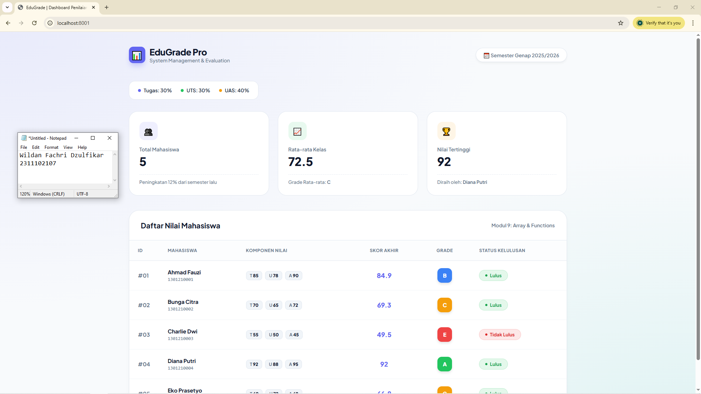

<div align="center">
    <br />
    <h1>LAPORAN PRAKTIKUM <br> APLIKASI BERBASIS PLATFORM </h1>
    <br />
    <h3>MODUL 9 <br> PHP </h3>
    <br />
    
    <br />
    <br />
    <br />
    <h3>Disusun Oleh :</h3>
    <p>
        <strong>Wildan Fachri Dzulfikar</strong>
        <br>
        <strong>2311102107</strong>
        <br>
        <strong>S1 IF-11-REG05</strong>
    </p>
    <br />
    <h3>Dosen Pengampu :</h3>
    <p>
        <strong>Dedi Agung Prabowo, S.Kom., M.Kom</strong>
    </p>
    <br />
    <br />
    <h4>Asisten Praktikum :</h4>
    <strong>Apri Pandu Wicaksono </strong>
    <br>
    <strong>Hamka Zaenul Ardi</strong>
    <br />
    <h3>LABORATORIUM HIGH PERFORMANCE <br>FAKULTAS INFORMATIKA <br>UNIVERSITAS TELKOM PURWOKERTO <br>2026 </h3>
</div>
<hr>

## Dasar Teori

PHP, atau singkatan dari PHP: Hypertext Preprocessor, adalah bahasa pemrograman server-side scripting yang dirancang khusus untuk pengembangan web dinamis. Berbeda dengan bahasa client-side seperti HTML atau CSS yang diproses langsung oleh browser, kode PHP dieksekusi di server sebelum hasilnya dikirimkan ke pengguna dalam bentuk HTML murni. Hal ini memungkinkan pengembang untuk menciptakan konten yang berubah-ubah secara otomatis, mengelola sesi pengguna, serta berinteraksi dengan basis data untuk menyimpan atau mengambil informasi secara real-time.

Secara teknis, PHP bersifat open-source dan memiliki sintaksis yang sangat fleksibel, yang banyak mengadopsi struktur dari bahasa C, Java, dan Perl. Kepopulerannya didukung oleh kemampuannya untuk berjalan di berbagai sistem operasi seperti Windows, Linux, dan macOS, serta kompatibilitasnya yang luas dengan hampir semua jenis server web (seperti Apache dan Nginx). Karena sifatnya yang mudah dipelajari namun tetap bertenaga, PHP menjadi tulang punggung bagi berbagai platform besar di internet, mulai dari sistem manajemen konten (CMS) seperti WordPress hingga media sosial.

Dalam arsitektur aplikasi web, PHP berperan sebagai jembatan penghubung antara tampilan antarmuka pengguna dan penyimpanan data backend. Dengan menggunakan PHP, pengembang dapat melakukan operasi logika yang kompleks, seperti validasi formulir, enkripsi data, hingga integrasi API pihak ketiga. Dukungan komunitas yang masif selama puluhan tahun memastikan PHP terus berevolusi dengan fitur-fitur modern seperti pemrograman berorientasi objek (OOP) dan sistem keamanan yang semakin ketat, menjadikannya pilihan standar bagi pengembang web di seluruh dunia.

## Tugas Modul 9 - PHP: Buat Sistem Penilaian Mahasiswa

### Source Code

```php
<?php
$mahasiswa = [
    [
        'nama'         => 'Ahmad Fauzi',
        'nim'          => '1301210001',
        'nilai_tugas'  => 85,
        'nilai_uts'    => 78,
        'nilai_uas'    => 90
    ],
    [
        'nama'         => 'Bunga Citra',
        'nim'          => '1301210002',
        'nilai_tugas'  => 70,
        'nilai_uts'    => 65,
        'nilai_uas'    => 72
    ],
    [
        'nama'         => 'Charlie Dwi',
        'nim'          => '1301210003',
        'nilai_tugas'  => 55,
        'nilai_uts'    => 50,
        'nilai_uas'    => 45
    ],
    [
        'nama'         => 'Diana Putri',
        'nim'          => '1301210004',
        'nilai_tugas'  => 92,
        'nilai_uts'    => 88,
        'nilai_uas'    => 95
    ],
    [
        'nama'         => 'Eko Prasetyo',
        'nim'          => '1301210005',
        'nilai_tugas'  => 60,
        'nilai_uts'    => 72,
        'nilai_uas'    => 68
    ]
];

function hitungNilaiAkhir($tugas, $uts, $uas) {
    $nilai_akhir = ($tugas * 0.30) + ($uts * 0.30) + ($uas * 0.40);
    return round($nilai_akhir, 2);
}

function tentukanGrade($nilai_akhir) {
    if ($nilai_akhir >= 85) {
        return 'A';
    } elseif ($nilai_akhir >= 75) {
        return 'B';
    } elseif ($nilai_akhir >= 65) {
        return 'C';
    } elseif ($nilai_akhir >= 50) {
        return 'D';
    } else {
        return 'E';
    }
}

function tentukanStatus($nilai_akhir) {
    if ($nilai_akhir >= 60) {
        return 'Lulus';
    } else {
        return 'Tidak Lulus';
    }
}

function warnaGrade($grade) {
    switch ($grade) {
        case 'A': return '#22c55e'; // Emerald
        case 'B': return '#3b82f6'; // Blue
        case 'C': return '#f59e0b'; // Amber
        case 'D': return '#f97316'; // Orange
        case 'E': return '#ef4444'; // Red
        default:  return '#94a3b8'; // Slate
    }
}

$total_nilai = 0;
$nilai_tertinggi = 0;
$mahasiswa_terbaik = '';

for ($i = 0; $i < count($mahasiswa); $i++) {
    $na = hitungNilaiAkhir(
        $mahasiswa[$i]['nilai_tugas'],
        $mahasiswa[$i]['nilai_uts'],
        $mahasiswa[$i]['nilai_uas']
    );
    $mahasiswa[$i]['nilai_akhir'] = $na;
    $mahasiswa[$i]['grade']       = tentukanGrade($na);
    $mahasiswa[$i]['status']      = tentukanStatus($na);

    $total_nilai += $na;

    if ($na > $nilai_tertinggi) {
        $nilai_tertinggi = $na;
        $mahasiswa_terbaik = $mahasiswa[$i]['nama'];
    }
}
```

**Kode Lengkap:** [index.php](index.php)

Output:


### Penjelasan

Website ini adalah sebuah dasbor manajemen penilaian mahasiswa berbasis PHP yang berfungsi untuk mengolah data akademik secara otomatis menggunakan struktur array multidimensional dan fungsi logika kustom. Sistem ini secara cerdas menghitung nilai akhir berdasarkan bobot persentase tertentu, menentukan grade serta status kelulusan, dan menyajikannya dalam antarmuka modern yang responsif dan informatif.