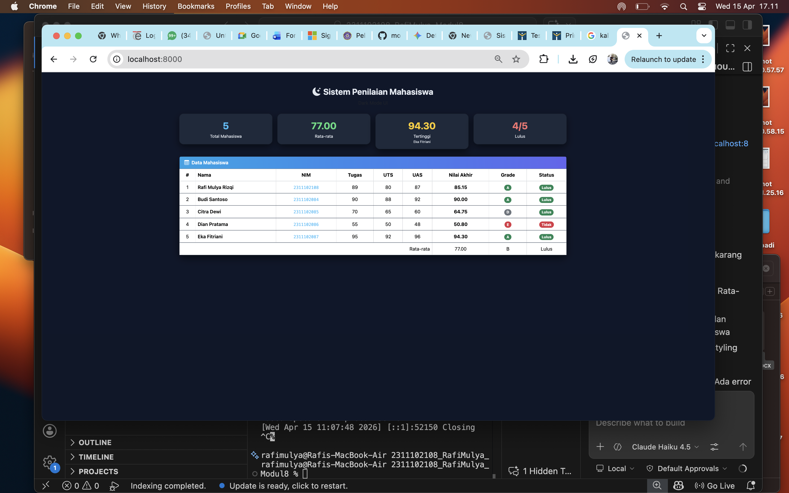

<div align="center">
    <br />
    <h1>LAPORAN PRAKTIKUM <br> APLIKASI BERBASIS PLATFORM </h1>
    <br />
    <h3>MODUL 9 <br> PHP </h3>
    <br />
    
    <br />
    <br />
    <br />
    <h3>Disusun Oleh :</h3>
    <p>
        <strong>Rafi Mulya Rizqi</strong>
        <br>
        <strong>2311102108</strong>
        <br>
        <strong>S1 IF-11-REG05</strong>
    </p>
    <br />
    <h3>Dosen Pengampu :</h3>
    <p>
        <strong>Dedi Agung Prabowo, S.Kom., M.Kom</strong>
    </p>
    <br />
    <br />
    <h4>Asisten Praktikum :</h4>
    <strong>Apri Pandu Wicaksono </strong>
    <br>
    <strong>Hamka Zaenul Ardi</strong>
    <br />
    <h3>LABORATORIUM HIGH PERFORMANCE <br>FAKULTAS INFORMATIKA <br>UNIVERSITAS TELKOM PURWOKERTO <br>2026 </h3>
</div>
<hr>

## Dasar Teori

PHP (Hypertext Preprocessor) adalah bahasa pemrograman server-side scripting yang digunakan untuk mengembangkan aplikasi web dinamis. PHP dijalankan di sisi server, sehingga kode PHP tidak terlihat oleh pengguna, melainkan diproses terlebih dahulu oleh server dan hasilnya dikirim ke browser dalam bentuk HTML.

PHP sangat populer dalam pengembangan web karena sifatnya yang open-source, mudah dipelajari, serta memiliki integrasi yang kuat dengan berbagai database seperti MySQL dan PostgreSQL. PHP juga mendukung berbagai paradigma pemrograman, termasuk procedural dan object-oriented programming (OOP), sehingga fleksibel untuk berbagai skala aplikasi, mulai dari website sederhana hingga sistem enterprise.

Dalam arsitektur web, PHP biasanya digunakan sebagai bagian dari stack backend, seperti pada arsitektur LAMP (Linux, Apache, MySQL, PHP). PHP bertugas menangani logika bisnis, pengolahan data, autentikasi pengguna, serta komunikasi dengan database melalui query SQL.

## Tugas Modul 9 - PHP: Buat Sistem Penilaian Mahasiswa

### Source Code

```php
<?php
// ============================================================
// 2311102108 - Rafi Mulya Rizqi
// Sistem Penilaian Mahasiswa - Modul 8 
// ============================================================

$mahasiswa = [
    ["nama"=>"Rafi Mulya Rizqi","nim"=>"2311102108","nilai_tugas"=>89,"nilai_uts"=>80,"nilai_uas"=>87],
    ["nama"=>"Budi Santoso","nim"=>"2311102084","nilai_tugas"=>90,"nilai_uts"=>88,"nilai_uas"=>92],
    ["nama"=>"Citra Dewi","nim"=>"2311102085","nilai_tugas"=>70,"nilai_uts"=>65,"nilai_uas"=>60],
    ["nama"=>"Dian Pratama","nim"=>"2311102086","nilai_tugas"=>55,"nilai_uts"=>50,"nilai_uas"=>48],
    ["nama"=>"Eka Fitriani","nim"=>"2311102087","nilai_tugas"=>95,"nilai_uts"=>92,"nilai_uas"=>96],
];

function hitungNilaiAkhir($tugas,$uts,$uas){
    return ($tugas*0.30)+($uts*0.35)+($uas*0.35);
}

function tentukanGrade($nilai){
    if($nilai>=85) return "A";
    elseif($nilai>=75) return "B";
    elseif($nilai>=65) return "C";
    elseif($nilai>=55) return "D";
    else return "E";
}

function tentukanStatus($nilai){
    return $nilai>=60?"Lulus":"Tidak Lulus";
}

$totalNilai=0;
$nilaiTertinggi=0;
$namaTertinggi="";

foreach($mahasiswa as &$mhs){
    $mhs["nilai_akhir"]=hitungNilaiAkhir($mhs["nilai_tugas"],$mhs["nilai_uts"],$mhs["nilai_uas"]);
    $mhs["grade"]=tentukanGrade($mhs["nilai_akhir"]);
    $mhs["status"]=tentukanStatus($mhs["nilai_akhir"]);

    $totalNilai += $mhs["nilai_akhir"];

    if($mhs["nilai_akhir"]>$nilaiTertinggi){
        $nilaiTertinggi=$mhs["nilai_akhir"];
        $namaTertinggi=$mhs["nama"];
    }
}
unset($mhs);

$rataRata=$totalNilai/count($mahasiswa);

$jumlahLulus=0;
foreach($mahasiswa as $mhs){
    if($mhs["status"]==="Lulus") $jumlahLulus++;
}
?>

<!DOCTYPE html>
<html lang="id">
<head>
<meta charset="UTF-8">
<meta name="viewport" content="width=device-width, initial-scale=1.0">
<title>Sistem Penilaian Mahasiswa</title>

<link href="https://cdn.jsdelivr.net/npm/bootstrap@5.3.3/dist/css/bootstrap.min.css" rel="stylesheet"/>
<link href="https://cdn.jsdelivr.net/npm/bootstrap-icons@1.11.3/font/bootstrap-icons.css" rel="stylesheet"/>

<style>
body{
    background:#0f172a;
    color:#e2e8f0;
}

/* Card */
.card{
    background:#1e293b;
    border-radius:15px;
    color:#e2e8f0;
    box-shadow:0 10px 25px rgba(0,0,0,0.5);
}

/* Header text */
h3,p{
    color:#e2e8f0;
}

/* Table */
.table{
    color:#e2e8f0;
}
.table thead{
    background:#334155;
}
.table tbody tr{
    border-color:#334155;
}
.table-hover tbody tr:hover{
    background:#1e293b;
}
tfoot{
    background:#334155;
}

/* Header card */
.card-header{
    background:linear-gradient(90deg,#0ea5e9,#6366f1);
    color:white;
}

/* Badge */
.badge{
    border-radius:20px;
}

/* Statistik */
.text-primary{color:#38bdf8 !important;}
.text-success{color:#4ade80 !important;}
.text-warning{color:#facc15 !important;}
.text-danger{color:#f87171 !important;}

/* Code */
code{
    color:#38bdf8;
}
</style>

</head>
<body>

<div class="container py-5">

<div class="text-center mb-4">
    <h3 class="fw-bold"><i class="bi bi-moon-stars-fill me-2"></i>Sistem Penilaian Mahasiswa</h3>
    <p class="text-muted mb-0">Dark Mode UI</p>
</div>

<!-- Statistik -->
<div class="row g-3 mb-4">
    <div class="col-md-3">
        <div class="card text-center p-3">
            <div class="fs-2 fw-bold text-primary"><?=count($mahasiswa)?></div>
            <small>Total Mahasiswa</small>
        </div>
    </div>
    <div class="col-md-3">
        <div class="card text-center p-3">
            <div class="fs-2 fw-bold text-success"><?=number_format($rataRata,2)?></div>
            <small>Rata-rata</small>
        </div>
    </div>
    <div class="col-md-3">
        <div class="card text-center p-3">
            <div class="fs-2 fw-bold text-warning"><?=number_format($nilaiTertinggi,2)?></div>
            <small>Tertinggi</small>
            <div style="font-size:11px"><?=$namaTertinggi?></div>
        </div>
    </div>
    <div class="col-md-3">
        <div class="card text-center p-3">
            <div class="fs-2 fw-bold text-danger"><?=$jumlahLulus?>/<?=count($mahasiswa)?></div>
            <small>Lulus</small>
        </div>
    </div>
</div>

<!-- Tabel -->
<div class="card">
<div class="card-header fw-semibold">
    <i class="bi bi-table me-2"></i>Data Mahasiswa
</div>

<div class="table-responsive">
<table class="table table-hover text-center mb-0">
<thead>
<tr>
<th>#</th>
<th class="text-start">Nama</th>
<th>NIM</th>
<th>Tugas</th>
<th>UTS</th>
<th>UAS</th>
<th>Nilai Akhir</th>
<th>Grade</th>
<th>Status</th>
</tr>
</thead>

<tbody>
<?php $no=1; foreach($mahasiswa as $mhs): ?>
<tr>
<td><?=$no++?></td>
<td class="text-start fw-semibold"><?=$mhs["nama"]?></td>
<td><code><?=$mhs["nim"]?></code></td>
<td><?=$mhs["nilai_tugas"]?></td>
<td><?=$mhs["nilai_uts"]?></td>
<td><?=$mhs["nilai_uas"]?></td>
<td class="fw-bold"><?=number_format($mhs["nilai_akhir"],2)?></td>

<td>
<?php
$badge = match($mhs["grade"]){
"A"=>"success",
"B"=>"primary",
"C"=>"warning",
"D"=>"secondary",
default=>"danger"
};
?>
<span class="badge bg-<?=$badge?>"><?=$mhs["grade"]?></span>
</td>

<td>
<?php if($mhs["status"]==="Lulus"): ?>
<span class="badge bg-success">Lulus</span>
<?php else: ?>
<span class="badge bg-danger">Tidak</span>
<?php endif; ?>
</td>

</tr>
<?php endforeach; ?>
</tbody>

<tfoot>
<tr>
<td colspan="6" class="text-end">Rata-rata</td>
<td><?=number_format($rataRata,2)?></td>
<td><?=tentukanGrade($rataRata)?></td>
<td><?=tentukanStatus($rataRata)?></td>
</tr>
</tfoot>

</table>
</div>
</div>

</div>

</body>
</html>

> Kode lengkap tersedia di file `penilaian.php`

## Output



### Penjelasan

Website tersebut adalah Sistem Penilaian Mahasiswa berbasis PHP yang digunakan untuk menghitung nilai akhir, menentukan grade, dan status kelulusan.
Selain itu, website ini juga menampilkan statistik kelas seperti rata-rata nilai dan mahasiswa dengan nilai tertinggi.

