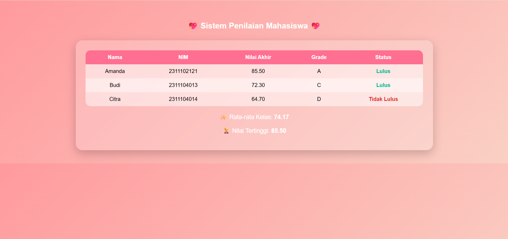

<div align="center">
  <br />
  <h1>LAPORAN PRAKTIKUM <br> APLIKASI BERBASIS PLATFORM </h1>
  <br />
  <h3>MODUL 9 <br> PHP </h3>
  <br />
  
  <br />
  <br />
  <br />
  <h3>Disusun Oleh :</h3>
  <p>
    <strong>Amanda Windhu Gustyas</strong>
    <br>
    <strong>2311102121</strong>
    <br>
    <strong>S1 IF-11-REG05</strong>
  </p>
  <br />
  <h3>Dosen Pengampu :</h3>
  <p>
    <strong>Dedi Agung Prabowo, S.Kom., M.Kom</strong>
  </p>
  <br />
  <br />
  <h4>Asisten Praktikum :</h4>
  <strong>Apri Pandu Wicaksono </strong>
  <br>
  <strong>Hamka Zaenul Ardi</strong>
  <br />
  <h3>LABORATORIUM HIGH PERFORMANCE <br>FAKULTAS INFORMATIKA <br>UNIVERSITAS TELKOM PURWOKERTO <br>2026 </h3>
</div>

<hr>

# Dasar Teori

PHP (Hypertext Preprocessor) adalah bahasa pemrograman yang digunakan untuk mengembangkan aplikasi web dinamis di sisi server (server-side). Artinya, kode PHP tidak dijalankan di browser pengguna, melainkan diproses terlebih dahulu oleh server web seperti Apache atau Nginx, kemudian hasilnya berupa HTML dikirimkan ke browser. Dengan cara ini, PHP memungkinkan pembuatan halaman web yang interaktif, seperti sistem login, pengolahan data formulir, hingga aplikasi berbasis database.

Secara historis, PHP pertama kali dikembangkan oleh Rasmus Lerdorf pada tahun 1995 sebagai kumpulan skrip sederhana untuk mengelola data pribadi di web. Seiring waktu, PHP berkembang menjadi bahasa pemrograman yang kuat dan banyak digunakan dalam pengembangan web, termasuk dalam berbagai sistem manajemen konten seperti WordPress dan framework seperti Laravel. Popularitas PHP didukung oleh kemudahan penggunaan, dokumentasi yang luas, serta komunitas yang besar.

Dalam konsep dasarnya, PHP bekerja dengan cara disisipkan ke dalam kode HTML. Penulisan kode PHP diawali dengan tag `<?php` dan diakhiri dengan `?>`. Ketika file dengan ekstensi `.php` diakses melalui browser, server akan mengeksekusi kode PHP tersebut dan menghasilkan output dalam bentuk HTML. Hal ini membuat PHP sangat fleksibel karena dapat menggabungkan logika pemrograman dengan tampilan antarmuka secara langsung.

PHP memiliki berbagai fitur penting seperti variabel, tipe data, operator, percabangan (if/else), perulangan (loop), serta fungsi yang memungkinkan pengelolaan kode menjadi lebih terstruktur. Selain itu, PHP juga mendukung pemrograman berbasis objek (Object-Oriented Programming/OOP), sehingga pengembang dapat membuat aplikasi yang lebih modular dan mudah dikembangkan. Dalam praktiknya, PHP sering digunakan untuk mengolah data dari pengguna, seperti input form, kemudian memprosesnya dan menyimpannya ke dalam database.

Salah satu keunggulan utama PHP adalah kemampuannya dalam berinteraksi dengan database, terutama MySQL. Dengan PHP, pengembang dapat melakukan operasi seperti menyimpan, mengambil, mengubah, dan menghapus data (CRUD). Hal ini menjadikan PHP sangat cocok untuk membangun aplikasi berbasis data seperti sistem informasi, e-commerce, dan aplikasi manajemen lainnya.

Selain itu, PHP juga bersifat open source, sehingga dapat digunakan secara gratis tanpa biaya lisensi. PHP dapat dijalankan di berbagai sistem operasi seperti Windows, Linux, dan macOS, serta kompatibel dengan berbagai server web. Kemudahan instalasi melalui tools seperti Laragon atau XAMPP membuat PHP semakin mudah dipelajari oleh pemula.

Secara keseluruhan, PHP merupakan bahasa pemrograman yang sangat penting dalam pengembangan web karena kemampuannya dalam membangun aplikasi yang dinamis, fleksibel, dan terintegrasi dengan database. Dengan sintaks yang relatif sederhana dan dukungan komunitas yang luas, PHP menjadi pilihan yang tepat bagi mahasiswa maupun pengembang dalam membangun berbagai jenis aplikasi berbasis web.


# Tugas 9
```php
//2311102121
//Amanda Windhu Gustyas

<?php
$mahasiswa = [
    ["nama"=>"Amanda","nim"=>"2311102121","tugas"=>85,"uts"=>80,"uas"=>90],
    ["nama"=>"Budi","nim"=>"2311104013","tugas"=>70,"uts"=>75,"uas"=>72],
    ["nama"=>"Citra","nim"=>"2311104014","tugas"=>60,"uts"=>65,"uas"=>68]
];

function hitungNilaiAkhir($t,$u,$a){
    return ($t*0.3)+($u*0.3)+($a*0.4);
}

function grade($n){
    if($n>=85)return "A";
    elseif($n>=75)return "B";
    elseif($n>=65)return "C";
    elseif($n>=50)return "D";
    else return "E";
}

function status($n){
    return ($n>=65)?"Lulus":"Tidak Lulus";
}

$total=0;
$max=0;
?>

<!DOCTYPE html>
<html>
<head>
<title>Sistem Penilaian</title>

<style>
body {
    font-family: 'Poppins', sans-serif;
    background: linear-gradient(135deg, #ff9a9e, #fad0c4);
    margin: 0;
    padding: 40px;
}

h2 {
    text-align: center;
    color: #fff;
    margin-bottom: 30px;
}

.container {
    width: 70%;
    margin: auto;
    background: rgba(255,255,255,0.2);
    backdrop-filter: blur(10px);
    border-radius: 20px;
    padding: 30px;
    box-shadow: 0 10px 30px rgba(0,0,0,0.2);
}

table {
    width: 100%;
    border-collapse: collapse;
    overflow: hidden;
    border-radius: 15px;
}

th {
    background: #ff6f91;
    color: white;
    padding: 12px;
}

td {
    padding: 12px;
    text-align: center;
    background: rgba(255,255,255,0.7);
}

tr:nth-child(even) td {
    background: rgba(255,255,255,0.5);
}

tr:hover td {
    background: #ffe0ea;
    transition: 0.3s;
}

.lulus {
    color: #00b894;
    font-weight: bold;
}

.tidak {
    color: #d63031;
    font-weight: bold;
}

.result {
    text-align: center;
    margin-top: 20px;
    font-size: 18px;
    color: white;
}
</style>

</head>
<body>

<h2>💖 Sistem Penilaian Mahasiswa 💖</h2>

<div class="container">

<table>
<tr>
<th>Nama</th>
<th>NIM</th>
<th>Nilai Akhir</th>
<th>Grade</th>
<th>Status</th>
</tr>

<?php foreach($mahasiswa as $m): 
$na = hitungNilaiAkhir($m['tugas'],$m['uts'],$m['uas']);
$g = grade($na);
$s = status($na);

$total += $na;
if($na > $max) $max = $na;
?>

<tr>
<td><?= $m['nama'] ?></td>
<td><?= $m['nim'] ?></td>
<td><?= number_format($na,2) ?></td>
<td><?= $g ?></td>
<td class="<?= ($s=='Lulus')?'lulus':'tidak' ?>">
<?= $s ?>
</td>
</tr>

<?php endforeach; ?>
</table>

<?php $avg = $total / count($mahasiswa); ?>

<div class="result">
<p>✨ Rata-rata Kelas: <b><?= number_format($avg,2) ?></b></p>
<p>🏆 Nilai Tertinggi: <b><?= number_format($max,2) ?></b></p>
</div>

</div>

</body>
</html>
```
Output:
<p align="center">
  
</p>

# Penjelasan
Pada program tersebut, PHP dan CSS digunakan secara bersamaan untuk membangun tampilan dan logika sistem penilaian mahasiswa. PHP berperan sebagai bahasa pemrograman sisi server yang digunakan untuk mengolah data mahasiswa, seperti menghitung nilai akhir, menentukan grade, serta status kelulusan. Data mahasiswa disimpan dalam bentuk array, kemudian diproses menggunakan function seperti perhitungan nilai dan kondisi if/else untuk menentukan hasilnya. Setelah itu, PHP juga digunakan untuk menampilkan data ke dalam bentuk tabel HTML secara dinamis menggunakan perulangan.

Sedangkan CSS digunakan untuk mengatur tampilan agar lebih menarik dan tidak terlihat seperti halaman HTML biasa. CSS memberikan desain seperti warna background gradasi pink, tabel yang rapi, efek bayangan (shadow), serta pengaturan warna pada status kelulusan seperti hijau untuk “Lulus” dan merah untuk “Tidak Lulus”. Selain itu, CSS juga mengatur posisi teks agar berada di tengah dan memberikan efek visual yang lebih modern.

Dengan kombinasi PHP dan CSS tersebut, program tidak hanya mampu mengolah data secara otomatis, tetapi juga menghasilkan tampilan yang lebih estetis dan user-friendly. Hal ini menunjukkan bahwa PHP berfungsi untuk logika dan pengolahan data, sedangkan CSS berfungsi untuk memperindah tampilan antarmuka.


