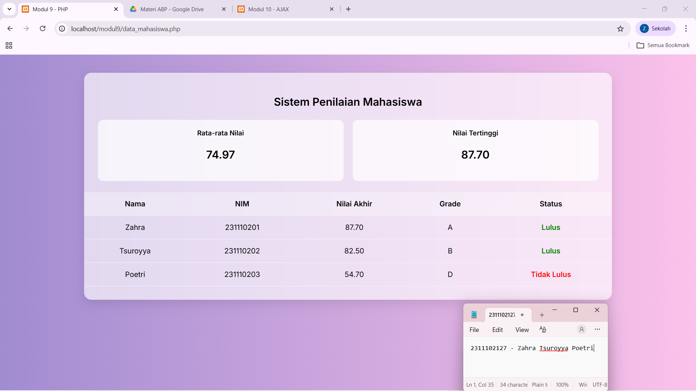

<div align="center">
  <br />
  <h1>LAPORAN PRAKTIKUM <br> APLIKASI BERBASIS PLATFORM </h1>
  <br />
  <h3>MODUL 9 <br> PHP </h3>
  <br />
  
  <br />
  <br />
  <br />
  <h3>Disusun Oleh :</h3>
  <p>
    <strong>Zahra Tsuroyya Poetri</strong>
    <br>
    <strong>2311102127</strong>
    <br>
    <strong>S1 IF-11-REG05</strong>
  </p>
  <br />
  <h3>Dosen Pengampu :</h3>
  <p>
    <strong>Dedi Agung Prabowo, S.Kom., M.Kom</strong>
  </p>
  <br />
  <br />
  <h4>Asisten Praktikum :</h4>
  <strong>Apri Pandu Wicaksono </strong>
  <br>
  <strong>Hamka Zaenul Ardi</strong>
  <br />
  <h3>LABORATORIUM HIGH PERFORMANCE <br>FAKULTAS INFORMATIKA <br>UNIVERSITAS TELKOM PURWOKERTO <br>2026</h3>
</div>

<hr>

### Dasar Teori

PHP (PHP: Hypertext Preprocessor) adalah bahasa pemrograman server-side scripting yang digunakan untuk membuat website dinamis. Berbeda dengan HTML yang bersifat statis, PHP dapat berinteraksi dengan database, file, dan sistem sehingga mampu menghasilkan konten yang berubah-ubah sesuai kebutuhan.

PHP bersifat cross-platform, sehingga dapat dijalankan di berbagai sistem operasi seperti Windows, Linux, dan Mac. Bahasa ini pertama kali dikembangkan oleh Rasmus Lerdorf pada tahun 1995 dan bersifat open-source.

Dalam penggunaannya, PHP memerlukan web server (seperti Apache) untuk memproses kode, serta biasanya terhubung dengan database seperti MySQL untuk penyimpanan data. Untuk mempermudah instalasi dan konfigurasi, tersedia paket seperti XAMPP, WAMP, atau MAMP yang sudah menggabungkan Apache, PHP, dan MySQL dalam satu instalasi.

## Tugas 9 - Buat Sistem Penilaian Mahasiswa

### Source Code 

```<!DOCTYPE html>
<html>
<head>
    <title>Modul 9 - PHP</title>

    <link href="https://fonts.googleapis.com/css2?family=Inter:wght@300;400;600&display=swap" rel="stylesheet">

    <style>
        body {
            font-family: 'Inter', sans-serif;
            background: linear-gradient(to right, #a18cd1, #fbc2eb);
            margin: 0;
            padding: 40px;
        }

        .container {
            width: 80%;
            margin: auto;
            background: rgba(255,255,255,0.65);
            padding: 30px 0;
            border-radius: 16px;
            box-shadow: 0 10px 25px rgba(0,0,0,0.1);
            backdrop-filter: blur(12px);
        }

        h2 {
            text-align: center;
            margin-bottom: 25px;
        }

        .cards {
            display: flex;
            gap: 20px;
            margin: 0 30px 25px;
        }

        .card {
            flex: 1;
            background: rgba(255,255,255,0.7);
            padding: 20px;
            border-radius: 12px;
            text-align: center;
        }

        .card h3 {
            margin: 0;
            font-size: 15px;
        }

        .card p {
            font-size: 24px;
            font-weight: 600;
        }

        table {
            width: 100%;
            border-collapse: collapse;
        }

        th,
        td {
            padding: 16px;
            text-align: center;
        }

        th {
            background: rgba(255,255,255,0.3);
        }

        tr {
            border-bottom: 1px solid rgba(255,255,255,0.6);
        }

        .lulus {
            color: green;
            font-weight: bold;
        }

        .tidak {
            color: red;
            font-weight: bold;
        }
    </style>
</head>

<body>

    <div class="container">
        <h2>Sistem Penilaian Mahasiswa</h2>

        <?php
            $mahasiswa = [
                ["nama" => "Zahra", "nim" => "231110201", "tugas" => 85, "uts" => 90, "uas" => 88],
                ["nama" => "Tsuroyya", "nim" => "231110202", "tugas" => 80, "uts" => 75, "uas" => 90],
                ["nama" => "Poetri", "nim" => "231110203", "tugas" => 50, "uts" => 55, "uas" => 58]
            ];

            function hitungNilaiAkhir($tugas, $uts, $uas) {
                return ($tugas * 0.3) + ($uts * 0.3) + ($uas * 0.4);
            }

            function tentukanGrade($nilai) {
                if ($nilai >= 85) return "A";
                elseif ($nilai >= 75) return "B";
                elseif ($nilai >= 65) return "C";
                elseif ($nilai >= 50) return "D";
                else return "E";
            }

            $totalNilai = 0;
            $nilaiTertinggi = 0;
            $rows = "";

            foreach ($mahasiswa as $m) {

                $nilaiAkhir = hitungNilaiAkhir($m["tugas"], $m["uts"], $m["uas"]);
                $grade = tentukanGrade($nilaiAkhir);
                $status = ($nilaiAkhir >= 60) ? "Lulus" : "Tidak Lulus";
                $class  = ($nilaiAkhir >= 60) ? "lulus" : "tidak";

                $totalNilai += $nilaiAkhir;

                if ($nilaiAkhir > $nilaiTertinggi) {
                    $nilaiTertinggi = $nilaiAkhir;
                }

                $rows .= "
                    <tr>
                        <td>{$m['nama']}</td>
                        <td>{$m['nim']}</td>
                        <td>" . number_format($nilaiAkhir, 2) . "</td>
                        <td>$grade</td>
                        <td class='$class'>$status</td>
                    </tr>
                ";
            }

            $rataRata = $totalNilai / count($mahasiswa);
        ?>

        <div class="cards">
            <div class="card">
                <h3>Rata-rata Nilai</h3>
                <p><?= number_format($rataRata, 2) ?></p>
            </div>

            <div class="card">
                <h3>Nilai Tertinggi</h3>
                <p><?= number_format($nilaiTertinggi, 2) ?></p>
            </div>
        </div>

        <table>
            <tr>
                <th>Nama</th>
                <th>NIM</th>
                <th>Nilai Akhir</th>
                <th>Grade</th>
                <th>Status</th>
            </tr>

            <?= $rows ?>

        </table>
    </div>

</body>
</html>
```

### Hasil Output



### Deskripsi Kode

Kode tersebut merupakan program PHP yang digunakan untuk mengelola dan menampilkan data penilaian mahasiswa. Program tersebut menyimpan data mahasiswa menggunakan array asosiatif yang berisi nama, NIM, nilai tugas, UTS, dan UAS. Selanjutnya, program menghitung nilai akhir setiap mahasiswa menggunakan fungsi khusus dengan operasi aritmatika.

Dalam prosesnya, program juga menentukan grade berdasarkan nilai akhir menggunakan percabangan if/else, serta menentukan status kelulusan dengan operator perbandingan. Seluruh data diproses menggunakan perulangan (loop) agar dapat menghitung total nilai, rata-rata kelas, dan nilai tertinggi.

Hasil output dari program ditampilkan dalam bentuk tabel HTML yang berisi informasi nama, NIM, nilai akhir, grade, dan status kelulusan. Selain itu, ditampilkan juga ringkasan dalam bentuk dashboard yang menunjukkan rata-rata nilai kelas dan nilai tertinggi.


