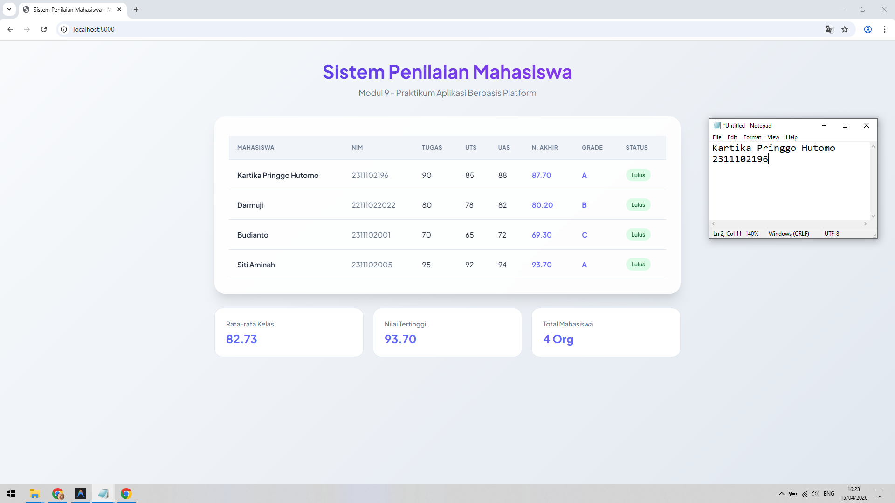

<div align="center">
    <br />
    <h1>LAPORAN PRAKTIKUM <br> APLIKASI BERBASIS PLATFORM </h1>
    <br />
    <h3>MODUL 9 <br> PHP </h3>
    <br />
    
    <br />
    <br />
    <br />
    <h3>Disusun Oleh :</h3>
    <p>
        <strong>Kartika Pringgo Hutomo</strong>
        <br>
        <strong>2311102196</strong>
        <br>
        <strong>S1 IF-11-REG05</strong>
    </p>
    <br />
    <h3>Dosen Pengampu :</h3>
    <p>
        <strong>Dedi Agung Prabowo, S.Kom., M.Kom</strong>
    </p>
    <br />
    <br />
    <h4>Asisten Praktikum :</h4>
    <strong>Apri Pandu Wicaksono </strong>
    <br>
    <strong>Hamka Zaenul Ardi</strong>
    <br />
    <h3>LABORATORIUM HIGH PERFORMANCE <br>FAKULTAS INFORMATIKA <br>UNIVERSITAS TELKOM PURWOKERTO <br>2026 </h3>
</div>
<hr>

## Dasar Teori

HP (Hypertext Preprocessor) adalah bahasa pemrograman server-side scripting yang bersifat open source. Sebagai bahasa server-side, kode PHP dieksekusi di server web sebelum hasilnya dikirimkan ke browser pengguna dalam bentuk HTML. PHP sangat populer untuk pengembangan web dinamis karena kemampuannya berinteraksi dengan basis data dan memproses formulir.

Dalam pembuatan sistem penilaian ini, beberapa konsep inti PHP yang digunakan adalah:

Array Asosiasi: Berbeda dengan array numerik biasa, array asosiasi menggunakan "key" (kunci) berupa string untuk mengakses nilainya. Ini sangat efektif untuk menyimpan data terstruktur seperti informasi mahasiswa (nama, nim, dll).

Function: Fungsi adalah blok kode yang dirancang untuk melakukan tugas tertentu. Penggunaan fungsi membantu modularitas kode, sehingga lebih mudah dibaca, diuji, dan digunakan kembali (reusable).

Kondisional (if/elseif/else): Digunakan untuk membuat keputusan dalam program. Dalam kasus ini, digunakan untuk menentukan grade dan status kelulusan berdasarkan nilai numerik.

Looping (foreach): Digunakan untuk mengiterasi (melakukan perulangan) pada setiap elemen array. Ini memungkinkan kita memproses data mahasiswa satu per satu tanpa menulis kode berulang.

## Tugas Modul 9 - PHP: Sistem Penilaian Mahasiswa

### Source Code

```php
<?php
/**
 * Tugas Modul 9 - PHP: Sistem Penilaian Mahasiswa
 * Nama: Kartika Pringgo Hutomo
 * NIM: 2311102196
 */
$daftar_mahasiswa = [
    [
        "nama" => "Kartika Pringgo Hutomo",
        "nim" => "2311102196",
        "tugas" => 90,
        "uts" => 85,
        "uas" => 88
    ],
    [
        "nama" => "Darmuji",
        "nim" => "22111022022",
        "tugas" => 80,
        "uts" => 78,
        "uas" => 82
    ],
    [
        "nama" => "Budianto",
        "nim" => "2311102001",
        "tugas" => 70,
        "uts" => 65,
        "uas" => 72
    ],
    [
        "nama" => "Siti Aminah",
        "nim" => "2311102005",
        "tugas" => 95,
        "uts" => 92,
        "uas" => 94
    ]
];

// 2. Function untuk menghitung nilai akhir (Bobot: Tugas 30%, UTS 30%, UAS 40%)
function hitungNilaiAkhir($tugas, $uts, $uas) {
    return ($tugas * 0.3) + ($uts * 0.3) + ($uas * 0.4);
}

// 3. Function untuk menentukan grade
function tentukanGrade($nilai) {
    if ($nilai >= 85) {
        return "A";
    } elseif ($nilai >= 75) {
        return "B";
    } elseif ($nilai >= 65) {
        return "C";
    } elseif ($nilai >= 50) {
        return "D";
    } else {
        return "E";
    }
}

// 4. Function untuk menentukan status kelulusan
function tentukanStatus($nilai) {
    return ($nilai >= 65) ? "Lulus" : "Tidak Lulus";
}

// Variabel pendukung statistik
$total_nilai = 0;
$nilai_tertinggi = 0;
$jumlah_mahasiswa = count($daftar_mahasiswa);

?>

<!DOCTYPE html>
<html lang="id">
<head>
    <meta charset="UTF-8">
    <meta name="viewport" content="width=device-width, initial-scale=1.0">
    <title>Sistem Penilaian Mahasiswa - Modul 9</title>
    <meta name="description" content="Aplikasi sederhana PHP untuk menghitung nilai mahasiswa, grade, dan status kelulusan.">
    <!-- Google Fonts -->
    <link rel="preconnect" href="https://fonts.googleapis.com">
    <link rel="preconnect" href="https://fonts.gstatic.com" crossorigin>
    <link href="https://fonts.googleapis.com/css2?family=Plus+Jakarta+Sans:wght@400;500;600;700&display=swap" rel="stylesheet">
    <style>
```

**Kode Lengkap:** [index.php](index.php)

Output:


### Penjelasan

Website ini adalah sistem manajemen nilai mahasiswa berbasis PHP yang secara otomatis menghitung nilai akhir, grade, dan status kelulusan berdasarkan data akademik yang diinput. Selain itu, sistem menyajikan data dalam tabel modern yang dilengkapi dengan statistik ringkas seperti rata-rata kelas dan nilai tertinggi untuk mempermudah evaluasi performa mahasiswa.