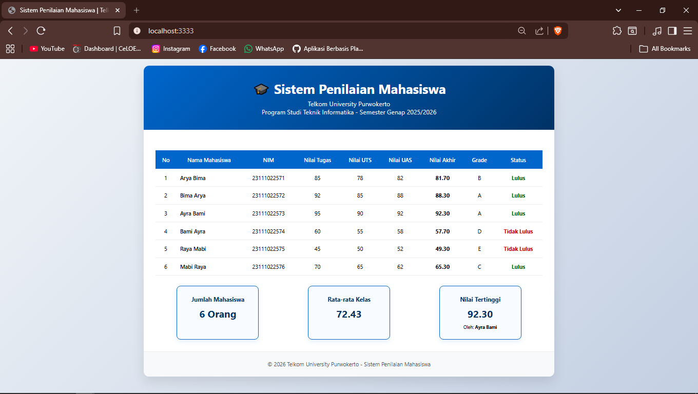

<div align="center">
  <br />
  <h1>LAPORAN PRAKTIKUM <br> APLIKASI BERBASIS PLATFORM </h1>
  <br />
  <h3>MODUL 9 <br> PHP </h3>
  <br />
  
  <br />
  <br />
  <br />
  <h3>Disusun Oleh :</h3>
  <p>
    <strong>Arya Bima</strong>
    <br>
    <strong>2311102257</strong>
    <br>
    <strong>S1 IF-11-REG05</strong>
  </p>
  <br />
  <h3>Dosen Pengampu :</h3>
  <p>
    <strong>Dedi Agung Prabowo, S.Kom., M.Kom</strong>
  </p>
  <br />
  <br />
  <h4>Asisten Praktikum :</h4>
  <strong>Apri Pandu Wicaksono </strong>
  <br>
  <strong>Hamka Zaenul Ardi</strong>
  <br />
  <h3>LABORATORIUM HIGH PERFORMANCE <br>FAKULTAS INFORMATIKA <br>UNIVERSITAS TELKOM PURWOKERTO <br>2026 </h3>
</div>

<hr>

# Dasar Teori
**PHP (Hypertext Preprocessor)**

PHP adalah bahasa pemrograman server-side scripting yang dirancang khusus untuk pengembangan web. PHP pertama kali dibuat oleh Rasmus Lerdorf pada tahun 1994 dengan nama Personal Home Page Tools. Seiring perkembangannya, PHP berkembang menjadi bahasa pemrograman open source yang powerful dan saat ini digunakan oleh jutaan website di seluruh dunia, termasuk situs besar seperti Facebook, Wikipedia, dan WordPress.

PHP bekerja di sisi server (server-side). Artinya, kode PHP diproses di server web sebelum dikirimkan ke browser pengguna dalam bentuk HTML murni. Hal ini membuat PHP sangat efisien karena pengguna hanya menerima hasil akhir tanpa melihat kode programnya.

### Karakteristik Utama PHP

1. **Server-Side Scripting**  
   PHP dieksekusi di server (Apache, Nginx, dll) dan hasilnya berupa HTML yang dikirim ke client. Kode PHP tidak terlihat oleh pengguna.

2. **Cross-Platform**  
   PHP dapat berjalan di berbagai sistem operasi, seperti Windows, Linux, macOS, dan berbagai web server.

3. **Gratis dan Open Source**  
   PHP dapat diunduh dan digunakan secara gratis di bawah lisensi PHP License.

4. **Mudah Dipelajari**  
   Sintaks PHP mirip dengan bahasa C, Java, dan Perl sehingga mudah dipahami oleh pemula sekaligus powerful untuk developer profesional.

5. **Integrasi dengan Database**  
   PHP memiliki dukungan yang sangat baik terhadap berbagai database, terutama MySQL/MariaDB, PostgreSQL, SQLite, dan MongoDB.

### Cara Kerja PHP

Ketika user mengakses halaman `.php` melalui browser:
- Browser mengirimkan request ke web server
- Web server meneruskan request ke PHP processor (PHP Engine)
- PHP engine mengeksekusi kode PHP
- Hasil eksekusi (biasanya berupa HTML, CSS, JavaScript) dikirim kembali ke browser


### Kelebihan PHP

- Kecepatan pengembangan yang tinggi
- Komunitas yang sangat besar
- Banyak framework modern (Laravel, CodeIgniter, Symfony, Yii, dll)
- Hosting yang murah dan mudah ditemukan
- Cocok untuk membangun website dinamis, sistem informasi, e-commerce, blog, dan aplikasi web lainnya

PHP tetap menjadi salah satu bahasa pemrograman paling populer untuk pengembangan web karena kestabilan, kemudahan penggunaan, dan ekosistem yang sangat matang.

---

# Tugas 9: Sistem Penilaian Mahasiswa

#### data.php:
```php
<?php

$mahasiswa = [
    [
        "nama" => "Arya Bima",
        "nim" => "23111022571",
        "tugas" => 85,
        "uts" => 78,
        "uas" => 82
    ],
    [
        "nama" => "Bima Arya",
        "nim" => "23111022572",
        "tugas" => 92,
        "uts" => 85,
        "uas" => 88
    ],
    [
        "nama" => "Ayra Bami",
        "nim" => "23111022573",
        "tugas" => 95,
        "uts" => 90,
        "uas" => 92
    ],
    [
        "nama" => "Bami Ayra",
        "nim" => "23111022574",
        "tugas" => 60,
        "uts" => 55,
        "uas" => 58
    ],
    [
        "nama" => "Raya Mabi",
        "nim" => "23111022575",
        "tugas" => 45,
        "uts" => 50,
        "uas" => 52
    ],
    [
        "nama" => "Mabi Raya",
        "nim" => "23111022576",
        "tugas" => 70,
        "uts" => 65,
        "uas" => 62
    ]
];
?>
```
#### functions.php:
```php
<?php

// Hitung Nilai Akhir (30% Tugas + 30% UTS + 40% UAS)
function hitungNilaiAkhir($tugas, $uts, $uas) {
    return ($tugas * 0.3) + ($uts * 0.3) + ($uas * 0.4);
}

// Tentukan Grade
function tentukanGrade($nilai) {
    if ($nilai >= 85) return "A";
    if ($nilai >= 75) return "B";
    if ($nilai >= 65) return "C";
    if ($nilai >= 55) return "D";
    return "E";
}

// Tentukan Status Kelulusan (KKM = 65)
function tentukanStatus($nilai) {
    return $nilai >= 65 ? "Lulus" : "Tidak Lulus";
}

// Format tampilan nilai
function formatNilai($nilai) {
    return number_format($nilai, 2);
}
?>
```
#### style.css:
```css
* {
    margin: 0;
    padding: 0;
    box-sizing: border-box;
}

body {
    font-family: 'Segoe UI', Tahoma, Geneva, Verdana, sans-serif;
    background: linear-gradient(135deg, #f0f4f8 0%, #c3cfe2 100%);
    min-height: 100vh;
    padding: 20px;
}

.container {
    max-width: 1200px;
    margin: 0 auto;
    background: white;
    border-radius: 16px;
    box-shadow: 0 15px 35px rgba(0, 0, 0, 0.1);
    overflow: hidden;
}

header {
    background: linear-gradient(135deg, #0066cc, #003366);
    color: white;
    padding: 40px 20px;
    text-align: center;
}

header h1 {
    font-size: 2.4rem;
    margin-bottom: 8px;
}

header .subtitle {
    font-size: 1.15rem;
    opacity: 0.95;
}

.content {
    padding: 35px;
}

table {
    width: 100%;
    border-collapse: collapse;
    margin: 25px 0;
    background: white;
}

th {
    background: #0066cc;
    color: white;
    padding: 16px 12px;
    text-align: center;
    font-weight: 600;
}

td {
    padding: 14px 12px;
    text-align: center;
    border-bottom: 1px solid #eee;
}

tr:hover {
    background-color: #f8fbff;
    transition: all 0.3s ease;
}

.nama {
    text-align: left;
    font-weight: 500;
}

.lulus {
    color: #006600;
    font-weight: bold;
}

.tidak-lulus {
    color: #cc0000;
    font-weight: bold;
}

.stat {
    display: flex;
    justify-content: space-around;
    flex-wrap: wrap;
    gap: 20px;
    margin-top: 30px;
}

.stat-card {
    background: #f8fbff;
    border: 2px solid #0066cc;
    border-radius: 12px;
    padding: 25px 20px;
    min-width: 240px;
    text-align: center;
    box-shadow: 0 5px 15px rgba(0, 102, 204, 0.1);
}

.stat-card h3 {
    color: #003366;
    margin-bottom: 10px;
    font-size: 1.1rem;
}

.highlight {
    font-size: 1.8rem;
    font-weight: bold;
    color: #003366;
    margin: 8px 0;
}

footer {
    text-align: center;
    padding: 25px;
    color: #555;
    background: #f8f9fa;
    border-top: 1px solid #eee;
}
```

#### index.php:
```php
<?php
require_once 'data.php';
require_once 'functions.php';
?>

<!DOCTYPE html>
<html lang="id">
<head>
    <meta charset="UTF-8">
    <meta name="viewport" content="width=device-width, initial-scale=1.0">
    <title>Sistem Penilaian Mahasiswa | Telkom University Purwokerto</title>
    <link rel="stylesheet" href="style.css">
</head>
<body>

<div class="container">
    <header>
        <h1>🎓 Sistem Penilaian Mahasiswa</h1>
        <p class="subtitle">Telkom University Purwokerto<br>Program Studi Teknik Informatika - Semester Genap 2025/2026</p>
    </header>

    <div class="content">

        <table>
            <tr>
                <th>No</th>
                <th>Nama Mahasiswa</th>
                <th>NIM</th>
                <th>Nilai Tugas</th>
                <th>Nilai UTS</th>
                <th>Nilai UAS</th>
                <th>Nilai Akhir</th>
                <th>Grade</th>
                <th>Status</th>
            </tr>

            <?php
            $total_nilai = 0;
            $nilai_tertinggi = 0;
            $mahasiswa_tertinggi = "";

            foreach ($mahasiswa as $index => $m) {
                $nilai_akhir = hitungNilaiAkhir($m['tugas'], $m['uts'], $m['uas']);
                $grade = tentukanGrade($nilai_akhir);
                $status = tentukanStatus($nilai_akhir);

                $total_nilai += $nilai_akhir;

                if ($nilai_akhir > $nilai_tertinggi) {
                    $nilai_tertinggi = $nilai_akhir;
                    $mahasiswa_tertinggi = $m['nama'];
                }

                $status_class = ($status === "Lulus") ? "lulus" : "tidak-lulus";
            ?>

            <tr>
                <td><?= $index + 1 ?></td>
                <td class="nama"><?= htmlspecialchars($m['nama']) ?></td>
                <td><?= $m['nim'] ?></td>
                <td><?= $m['tugas'] ?></td>
                <td><?= $m['uts'] ?></td>
                <td><?= $m['uas'] ?></td>
                <td><strong><?= formatNilai($nilai_akhir) ?></strong></td>
                <td><?= $grade ?></td>
                <td class="<?= $status_class ?>"><?= $status ?></td>
            </tr>

            <?php } ?>

        </table>

        <?php
        $rata_rata = $total_nilai / count($mahasiswa);
        ?>

        <div class="stat">
            <div class="stat-card">
                <h3>Jumlah Mahasiswa</h3>
                <div class="highlight"><?= count($mahasiswa) ?> Orang</div>
            </div>
            <div class="stat-card">
                <h3>Rata-rata Kelas</h3>
                <div class="highlight"><?= formatNilai($rata_rata) ?></div>
            </div>
            <div class="stat-card">
                <h3>Nilai Tertinggi</h3>
                <div class="highlight"><?= formatNilai($nilai_tertinggi) ?></div>
                <small>Oleh: <strong><?= htmlspecialchars($mahasiswa_tertinggi) ?></strong></small>
            </div>
        </div>

    </div>

    <footer>
        &copy; <?= date("Y") ?> Telkom University Purwokerto - Sistem Penilaian Mahasiswa<br>
    </footer>
</div>

</body>
</html>
```
output:


**Penjelasan:**
Sistem Penilaian ini menghitung nilai akhir secara otomatis menggunakan bobot 30% tugas, 30% UTS, dan 40% UAS, kemudian menentukan grade (A–E) serta status kelulusan (Lulus/Tidak Lulus) berdasarkan KKM 65.
Aplikasi ini menampilkan data dalam tabel yang responsif dan informatif, dilengkapi dengan statistik kelas seperti rata-rata nilai dan nilai tertinggi. Dibangun dengan pendekatan modular (terpisah antara data, fungsi, dan tampilan) untuk memudahkan development.