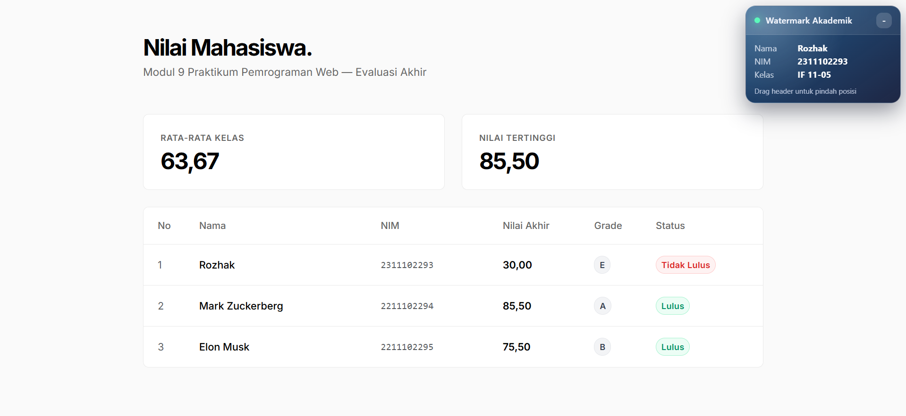

<div align="center">
    <br />
    <h1>LAPORAN PRAKTIKUM <br> APLIKASI BERBASIS PLATFORM </h1>
    <br />
    <h3>MODUL 9 <br> PHP </h3>
    <br />
    
    <br />
    <br />
    <br />
    <h3>Disusun Oleh :</h3>
    <p>
        <strong>Rozhak</strong>
        <br>
        <strong>2311102293</strong>
        <br>
        <strong>S1 IF-11-REG05</strong>
    </p>
    <br />
    <h3>Dosen Pengampu :</h3>
    <p>
        <strong>Dedi Agung Prabowo, S.Kom., M.Kom</strong>
    </p>
    <br />
    <br />
    <h4>Asisten Praktikum :</h4>
    <strong>Apri Pandu Wicaksono </strong>
    <br>
    <strong>Hamka Zaenul Ardi</strong>
    <br />
    <h3>LABORATORIUM HIGH PERFORMANCE <br>FAKULTAS INFORMATIKA <br>UNIVERSITAS TELKOM PURWOKERTO <br>2026 </h3>
</div>
<hr>

## Dasar Teori

Pembuatan halaman web dinamis sangat bergantung pada teknologi Server _Side Scripting_, yaitu skrip atau program yang dikompilasi dan diterjemahkan di peladen (server) sebelum hasilnya dikirimkan ke peramban klien dalam bentuk dokumen HTML statis. PHP (_Hypertext Preprocessor_) adalah salah satu bahasa pemrograman server-side yang paling umum digunakan untuk membangun arsitektur web dinamis ini.

Secara sintaksis dan fungsionalitas, PHP menyediakan berbagai elemen fundamental pemrograman. Salah satu yang paling penting adalah tipe data _Array_. Selain _array_ numerik standar, PHP memiliki _Array_ Asosiatif yang menggunakan string sebagai indeks atau kunci (_key_), sehingga sangat efisien untuk memetakan dan menyimpan koleksi data yang kompleks. Lebih lanjut, PHP dilengkapi dengan fitur pembuatan fungsi (_function_) yang memungkinkan modularisasi kode agar dapat digunakan ulang. Untuk mengatur alur logika, PHP mendukung berbagai struktur kontrol program seperti `if/else` dan `switch` untuk pengambilan keputusan, serta berbagai jenis perulangan (seperti `for`, `while`, dan `foreach`) untuk memanipulasi dan menelusuri data berulang.

## Tugas Modul 9 - PHP: Buat Sistem Penilaian Mahasiswa

### 1. Source Code

```php
<?php

$mahasiswa = [
    [
        ...
    ],
    [
        ...
    ],
    [
        ...
    ]
];

return $mahasiswa;
```

**Kode Lengkap:** [app/data.php](app/data.php)

```php
<?php

function hitungNilaiAkhir(float $tugas, float $uts, float $uas): float {
    $bobotTugas = $tugas * 0.30;
    $bobotUts = $uts * 0.30;
    $bobotUas = $uas * 0.40;

    return $bobotTugas + $bobotUts + $bobotUas;
}

function tentukanGrade(float $nilaiAkhir): string {
    if ($nilaiAkhir >= 85) {
        return 'A';
    } elseif ($nilaiAkhir >= 70) {
        return 'B';
    } elseif ($nilaiAkhir >= 60) {
        return 'C';
    } elseif ($nilaiAkhir >= 50) {
        return 'D';
    } else {
        return 'E';
    }
}

function tentukanStatus(float $nilaiAkhir): string {
    return ($nilaiAkhir >= 60) ? 'Lulus' : 'Tidak Lulus';
}
```

**Kode Lengkap:** [app/functions.php](app/functions.php)

```html
<!DOCTYPE html>
<html lang="id">
<head>
    ...
</head>
<body>
    <div class="container" style="max-width: 900px;">
        
        <!-- Header -->
        <header class="mb-5">
            <h1 class="page-title">Nilai Mahasiswa.</h1>
            <p class="page-subtitle">Modul 9 Praktikum Pemrograman Web &mdash; Evaluasi Akhir</p>
        </header>

        <!-- Stats Section -->
        <div class="row g-4 mb-4">
            ...
        </div>

        <!-- Table Section -->
        <div class="v-table-container">
            ...
        </div>

    </div>
</body>
</html>
```

**Kode Lengkap:** [views/template.php](views/template.php)

```php
<?php

$mahasiswa = require_once 'app/data.php';
require_once 'app/functions.php';

$dataDiproses = [];
$totalNilaiKelas = 0;
$nilaiTertinggi = 0;

if (!empty($mahasiswa) && is_array($mahasiswa)) {
    foreach ($mahasiswa as $mhs) {
        $nilaiAkhir = hitungNilaiAkhir($mhs['tugas'], $mhs['uts'], $mhs['uas']);
        $grade = tentukanGrade($nilaiAkhir);
        $status = tentukanStatus($nilaiAkhir);
    

        if ($nilaiAkhir > $nilaiTertinggi) {
            $nilaiTertinggi = $nilaiAkhir;
        }

        $totalNilaiKelas += $nilaiAkhir;

        $dataDiproses[] = [
            ...
        ];
    }
}

$jumlahMahasiswa = count($mahasiswa);
$rataRataKelas = ($jumlahMahasiswa > 0) ? ($totalNilaiKelas / $jumlahMahasiswa) : 0;

require_once 'views/template.php';
```

**Kode Lengkap:** [index.php](index.php)

### 2. Penjelasan

Program Sistem Penilaian Mahasiswa ini menggunakan struktur _Array Asosiatif_ Multidimensi untuk menyimpan data dari tiga mahasiswa yang mencakup nama, NIM, nilai tugas, UTS, dan UAS. Data tersebut kemudian diproses menggunakan beberapa fungsi khusus secara berurutan.

Fungsi `hitungNilaiAkhir()` digunakan untuk menghitung nilai akhir dengan menerapkan operator aritmatika berdasarkan persentase bobot setiap nilai. Selanjutnya, fungsi `tentukanGrade()` menggunakan kontrol `if/else` untuk mengonversi angka nilai menjadi huruf (A-E). Fungsi `tentukanStatus()` mengevaluasi kelulusan mahasiswa menggunakan operator perbandingan, dimana mahasiswa dinyatakan lulus jika nilainya mencapai batas minimal 60.

Seluruh prose perhitungan tersebut dijalankan di dalam perulangan `foreach` untuk proses setiap data mahasiswa satu per satu, sekaligus melakukan perhitungan nilai rata-rata kelas dan mencari nilai tertinggi. Pada tahap akhir, data akhir, grade, status kelulusan, dan statistik kelas yang dihitung dicetak dan ditampilkan dalam bentuk tabel HTML.

### 3. Output



## Kesimpulan

Berdasarkan keseluruhan pembelajaran pada Modul 9, dapat disimpulkan bahwa pemahaman terhadap bahasa PHP sebagai teknologi _Server Side Scripting_ merupakan fondasi mutlak yang diperlukan untuk merancang dan mengembangkan arsitektur halaman web yang dinamis.