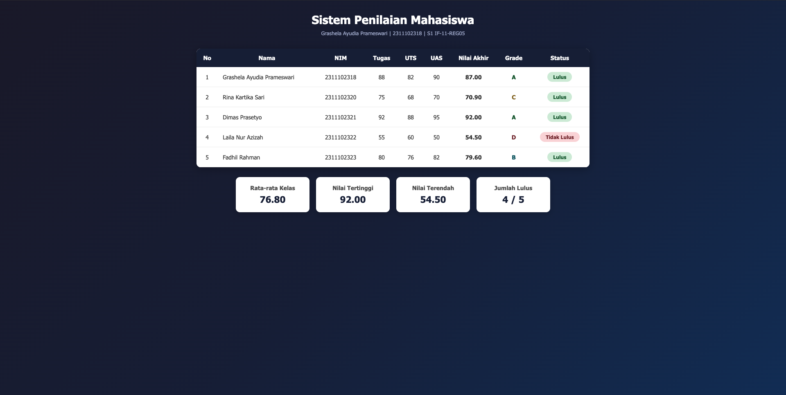

<div align="center">
  <br />
  <h1>LAPORAN PRAKTIKUM <br> APLIKASI BERBASIS PLATFORM </h1>
  <br />
  <h3>MODUL 9 <br> PHP</h3>
  <br />
  
  <br />
  <br />
  <br />
  <h3>Disusun Oleh :</h3>
  <p>
    <strong>Grashela Ayudia Prameswari</strong>
    <br>
    <strong>2311102318</strong>
    <br>
    <strong>S1 IF-11-REG05</strong>
  </p>
  <br />
  <h3>Dosen Pengampu :</h3>
  <p>
    <strong>Dedi Agung Prabowo, S.Kom., M.Kom</strong>
  </p>
  <br />
  <h4>Asisten Praktikum :</h4>
  <strong>Apri Pandu Wicaksono</strong>
  <br>
  <strong>Hamka Zaenul Ardi</strong>
  <br />
  <h3>LABORATORIUM HIGH PERFORMANCE <br>FAKULTAS INFORMATIKA <br>UNIVERSITAS TELKOM PURWOKERTO <br>2026</h3>
</div>

---

## Dasar Teori

PHP (_Hypertext Preprocessor_) adalah bahasa pemrograman _server-side scripting_ yang digunakan untuk membangun halaman web dinamis. PHP dieksekusi di sisi server dan menghasilkan output berupa HTML yang dikirim ke browser klien.

Dalam PHP, **Array Asosiatif** adalah tipe array yang menggunakan string sebagai kunci (_key_) untuk mengakses nilainya, berbeda dengan array numerik yang menggunakan indeks angka. Array asosiatif sangat berguna untuk menyimpan data terstruktur seperti informasi mahasiswa. PHP juga mendukung pembuatan **fungsi** (_function_) untuk modularisasi kode agar dapat digunakan kembali, serta berbagai **struktur kontrol** seperti `if/else` untuk pengambilan keputusan dan `foreach` untuk perulangan pada array.

## Tugas Modul 9 - PHP: Buat Sistem Penilaian Mahasiswa

### 1. Source Code

```php
<?php
// ================================================
// Sistem Penilaian Mahasiswa
// Nama  : Grashela Ayudia Prameswari
// NIM   : 2311102318
// Kelas : S1 IF-11-REG05
// ================================================

// Data mahasiswa menggunakan array asosiatif
$mahasiswa = [
    [
        "nama" => "Grashela Ayudia Prameswari",
        "nim" => "2311102318",
        "tugas" => 88,
        "uts" => 82,
        "uas" => 90
    ],
    [
        "nama" => "Rina Kartika Sari",
        "nim" => "2311102320",
        "tugas" => 75,
        "uts" => 68,
        "uas" => 70
    ],
    [
        ...
    ]
];

// Fungsi menghitung nilai akhir (Tugas 30%, UTS 30%, UAS 40%)
function hitungNilaiAkhir($tugas, $uts, $uas) {
    return ($tugas * 0.3) + ($uts * 0.3) + ($uas * 0.4);
}

// Fungsi menentukan grade menggunakan if/else
function getGrade($nilai) {
    if ($nilai >= 85) {
        return "A";
    } elseif ($nilai >= 75) {
        return "B";
    } elseif ($nilai >= 65) {
        return "C";
    } elseif ($nilai >= 50) {
        return "D";
    } else {
        return "E";
    }
}

// Fungsi menentukan status kelulusan menggunakan operator perbandingan
function getStatus($nilai) {
    return ($nilai >= 70) ? "Lulus" : "Tidak Lulus";
}

// Proses perhitungan statistik menggunakan loop
$totalNilai = 0;
$nilaiTertinggi = 0;
$nilaiTerendah = 100;
$jumlahLulus = 0;

foreach ($mahasiswa as $mhs) {
    $nilai = hitungNilaiAkhir($mhs['tugas'], $mhs['uts'], $mhs['uas']);
    $totalNilai += $nilai;
    $nilaiTertinggi = max($nilaiTertinggi, $nilai);
    $nilaiTerendah = min($nilaiTerendah, $nilai);
    if (getStatus($nilai) === "Lulus") {
        $jumlahLulus++;
    }
}

$rataRata = $totalNilai / count($mahasiswa);
?>

<!DOCTYPE html>
<html lang="id">
<head>
    ...
</head>
<body>
    <div class="container">
        <h1>Sistem Penilaian Mahasiswa</h1>
        <p class="watermark">Grashela Ayudia Prameswari | 2311102318 | S1 IF-11-REG05</p>
        <table>
            ...
        </table>
        <div class="summary">
            ...
        </div>
    </div>
</body>
</html>
```

**Kode Lengkap:** [index.php](index.php)

### 2. Penjelasan

Program Sistem Penilaian Mahasiswa ini menggunakan struktur **Array Asosiatif Multidimensi** untuk menyimpan data dari lima mahasiswa yang mencakup nama, NIM, nilai tugas, UTS, dan UAS.

Data tersebut diproses menggunakan tiga fungsi utama:
- Fungsi `hitungNilaiAkhir()` menghitung nilai akhir dengan bobot **Tugas 30% + UTS 30% + UAS 40%** menggunakan operator aritmatika.
- Fungsi `getGrade()` menggunakan struktur kontrol `if/elseif/else` untuk mengonversi nilai angka menjadi huruf grade (A-E).
- Fungsi `getStatus()` menggunakan operator ternary (perbandingan) untuk menentukan status kelulusan, dimana mahasiswa dinyatakan **Lulus** jika nilai akhir >= 70.

Seluruh proses perhitungan dijalankan dalam perulangan `foreach` yang memproses setiap data mahasiswa satu per satu, sekaligus menghitung statistik kelas berupa rata-rata nilai, nilai tertinggi, nilai terendah, dan jumlah mahasiswa yang lulus. Hasil akhir ditampilkan dalam bentuk tabel HTML dengan styling CSS dan summary cards untuk statistik kelas.

### 3. Output



## Kesimpulan

Melalui Modul 9 ini, dapat dipahami bahwa PHP sebagai bahasa _server-side scripting_ mampu memproses data secara dinamis menggunakan array asosiatif, fungsi, dan struktur kontrol. Program Sistem Penilaian Mahasiswa ini mendemonstrasikan penggunaan array asosiatif multidimensi untuk penyimpanan data, fungsi untuk modularisasi logika perhitungan, serta perulangan `foreach` untuk pemrosesan data secara iteratif dan menampilkan hasilnya dalam format HTML yang terstruktur.
